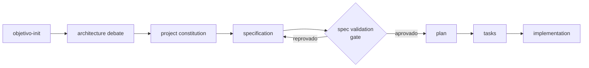
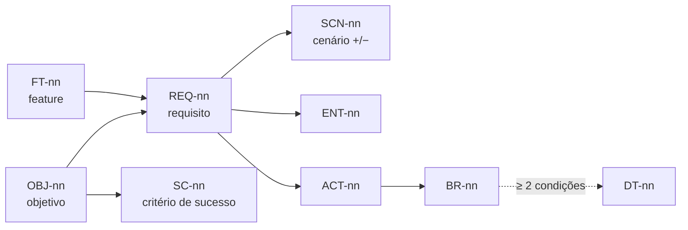
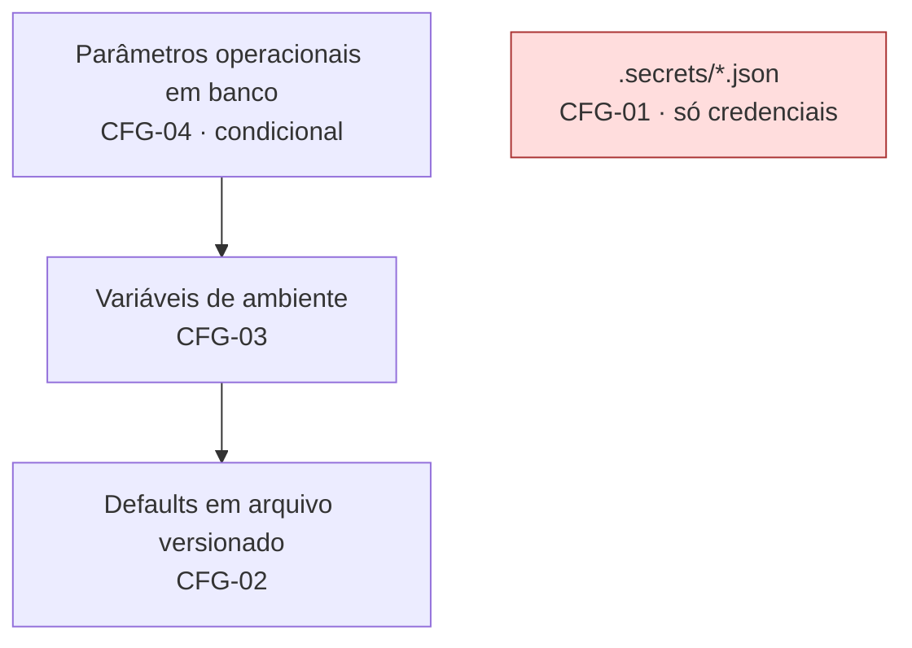
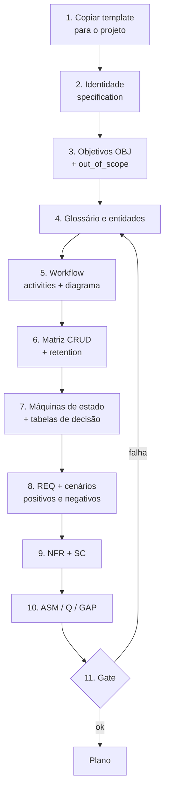

# objetivo-init-minimal v2

> Template raiz de especificação para projetos Python em arquitetura em camadas, com validação da especificação **antes** do plano e do código.

| Item | Valor |
|---|---|
| Versão do template | `2.0.0` (breaking em relação à v1) |
| Arquivo | `objetivo-init-minimal-v2.yaml` |
| Schema | `schemas/objetivo-init-schema-v2.json` (JSON Schema draft 2020-12) |
| Deriva de | `objetivo-init-minimal.yaml` v1 (modificado em 03/09/2026) |
| Criado em | 22/09/2026 |
| Idioma | pt-BR (chaves técnicas em inglês) |

---

## Sumário

1. [Para que serve](#1-para-que-serve)
2. [Por que existe uma v2](#2-por-que-existe-uma-v2)
3. [Visão geral do fluxo](#3-visão-geral-do-fluxo)
4. [Estrutura do arquivo](#4-estrutura-do-arquivo)
5. [Convenção de IDs e rastreabilidade](#5-convenção-de-ids-e-rastreabilidade)
6. [Referência das seções](#6-referência-das-seções)
7. [Como preencher (passo a passo)](#7-como-preencher-passo-a-passo)
8. [Validação](#8-validação)
9. [Módulos opcionais](#9-módulos-opcionais)
10. [Artefatos em `docs/spec/`](#10-artefatos-em-docsspec)
11. [Migração da v1 para a v2](#11-migração-da-v1-para-a-v2)
12. [Decisões de design](#12-decisões-de-design)
13. [Limitações conhecidas](#13-limitações-conhecidas)
14. [Perguntas frequentes](#14-perguntas-frequentes)
15. [Changelog](#15-changelog)
16. [Referências](#16-referências)

---

## 1. Para que serve

O `objetivo-init` é o **primeiro documento** de todo projeto. É dele que saem o debate de arquitetura, a constituição do projeto, a especificação, o plano, as tarefas e, por fim, o código. Ele é lido por pessoas e por agentes de IA, e por isso combina três funções:

| Função | Onde está no arquivo |
|---|---|
| **Especificação do problema:** o que o sistema faz, sobre quais dados, com quais regras | `specification` (identidade e objetivos), `domain_spec`, `functional_requirements`, `non_functional_requirements`, `features_to_implement` |
| **Governança de engenharia:** como o sistema deve ser construído | `architecture`, `configuration`, `regras_projeto`, `regras_gerais`, `expected_outcome` |
| **Contrato com agentes de IA:** como um assistente deve se comportar neste projeto | `ai_safety_instructions`, `profile`, `pending_tasks` |

O template é **agnóstico de ferramenta e de provider de IA**. Ele não depende de um editor, assistente ou modelo específico.

---

## 2. Por que existe uma v2

A v1 era sólida em governança de engenharia, mas **não tinha lugar para especificar o problema em si**. No projeto PraxisForge isso apareceu como uma lacuna de especificação só percebida depois, e a análise da v1 (documento `proposta-atualizacao-objetivo-init.md`) registrou 31 achados:

| Severidade | Qtd | Natureza |
|---|---|---|
| 🔴 Crítico | 5 | Sem modelo de domínio, sem workflow estruturado, sem gate de validação, sem critérios de aceite, sem registro de lacunas |
| 🟠 Alto | 9 | Contradições internas; RBAC obrigatório espalhado em 9 seções; NFR ausentes |
| 🟡 Médio | 11 | Regras duplicadas, requisitos não verificáveis, campos ambíguos |
| 🟢 Baixo | 6 | Nomenclatura, formato de data, referências pendentes |

Resumindo: a v1 garantia **como** construir, mas não garantia que **o quê** estava completo. A v2 resolve isso com três mudanças centrais:

1. **Especificação de domínio estruturada** (`domain_spec`): entidades, regras, workflow com erros previstos e matriz CRUD. É onde a lacuna teria aparecido.
2. **Gate `spec validation`** entre `specification` e `plan`, com uma Definition of Ready verificável.
3. **Rastreabilidade por IDs** de objetivo até cenário de aceite, com schema próprio para validar a estrutura.

---

## 3. Visão geral do fluxo



O gate é **bloqueante**: nenhum requisito é planejado ou implementado sem passar por ele. A regra de agente `task_execution` também reforça isso: *"NUNCA planejar ou implementar REQ cuja especificação não passou no gate de spec_validation"*.

O gate é aplicado **por fase** (`spec_validation.scope: current_phase`). Só os requisitos da fase atual precisam estar prontos, e o restante da especificação pode evoluir incrementalmente.

### Fases de trabalho

| Fase | Chave em `pending_tasks` | Conteúdo |
|---|---|---|
| 0 | `phase_0_specification` | Glossário, entidades, workflow, CRUD, estados, tabelas de decisão, cenários, premissas, gate |
| 1 | `phase_1_prerequisites` | Guias obrigatórios, schema, `spec-lint`, pre-commit |
| 2 | `phase_2_core_implementation` | Implementação das features (e do módulo RBAC, se ativo) |
| 3 | `phase_3_quality_validation` | Testes, cenários BDD, gates de qualidade, segurança, revisão de docs |

---

## 4. Estrutura do arquivo

```text
schema_version: "2.0.0"
prompt:
  role: user
  content:
    description                  ← instrução ao agente sobre este arquivo
    traceability                 ← convenção de IDs e regras de referência
    specification                ← identidade, objetivos, arquitetura, configuração, regras
      ├─ project_outputs
      ├─ out_of_scope
      ├─ objetivos               (OBJ-nn)
      ├─ architecture
      │   ├─ mandatory_requirements   (MR-nn)
      │   ├─ error_handling_standard  (EH-nn)
      │   ├─ ai_integration_standard  (AI-nn)
      │   └─ schema_versioning        (SV-nn)
      ├─ configuration           (CFG-nn)
      ├─ regras_projeto          (RP-nn)
      └─ regras_gerais           (RG-nn)
    domain_spec                  ← modelo do domínio
      ├─ glossary
      ├─ entities                (ENT-nn)
      ├─ business_rules          (BR-nn)
      ├─ operational_workflow    (ACT-nn)
      ├─ crud_matrix
      └─ decision_tables         (DT-nn)
    functional_requirements      (REQ-nn)
    non_functional_requirements  (NFR-nn)
    features_to_implement        (FT-nn)
    assumptions                  (ASM-nn)
    open_questions               (Q-nn)
    gaps                         (GAP-nnn → docs/spec/gaps/)
    spec_validation              ← gate e Definition of Ready
    modules                      ← módulos opcionais (rbac)
    required_documents
    folder_structure
    expected_outcome             ← entregáveis, SC-nn, DoD, quality gates
    infrastructure
    ai_safety_instructions
    profile
    pending_tasks                ← fases 0 a 3
```

A organização segue a decisão **D-2**: o YAML funciona como **índice** e o conteúdo extenso (diagramas Mermaid, cenários Gherkin, tabelas) fica em `docs/spec/`. Assim o YAML continua legível e cada artefato fica no formato mais adequado a ele.

---

## 5. Convenção de IDs e rastreabilidade

### 5.1 Prefixos

| Prefixo | Significado | Onde é definido |
|---|---|---|
| `OBJ` | Objetivo do projeto | `specification.objetivos` |
| `SC` | Critério de sucesso (resultado) | `expected_outcome.success_criteria` |
| `REQ` | Requisito funcional | `functional_requirements` |
| `NFR` | Requisito não funcional | `non_functional_requirements` |
| `BR` | Regra de negócio / invariante | `domain_spec.business_rules` |
| `ENT` | Entidade, value object ou agregado | `domain_spec.entities` |
| `ACT` | Atividade do workflow | `domain_spec.operational_workflow.activities` |
| `DT` | Tabela de decisão | `domain_spec.decision_tables` |
| `SCN` | Cenário de aceite (Gherkin) | `docs/spec/features/*.feature` |
| `FT` | Feature | `features_to_implement` |
| `ASM` | Premissa | `assumptions` |
| `Q` | Pergunta aberta | `open_questions` |
| `GAP` | Lacuna de especificação | `docs/spec/gaps/GAP-nnn.md` |
| `ADR` | Architecture Decision Record | `docs/architecture/adr/` |
| `MR`, `EH`, `AI`, `SV`, `CFG`, `RP`, `RG` | Regras de engenharia canônicas | `specification.*` |

### 5.2 Regras

- Todo ID é único no projeto e **nunca é reutilizado**, mesmo depois de removido.
- Toda referência a um ID precisa apontar para um item existente. Quem verifica isso é o `spec-lint` (ver [§13](#13-limitações-conhecidas)).
- Cada regra de engenharia existe em **um único lugar**. As outras seções referenciam o ID em vez de copiar o texto, porque cópias divergentes foram a origem de contradições na v1.

### 5.3 Cadeia mínima obrigatória



A matriz completa fica em `docs/spec/traceability.md`. Um exemplo de linha:

| OBJ | REQ | SCN | ENT / Contrato | Estado | Status |
|---|---|---|---|---|---|
| OBJ-02 | REQ-07 | SCN-12, SCN-13 | ENT-03 / `sintese-schema-v1` | — | ✅ |
| OBJ-02 | REQ-08 | SCN-14, SCN-15 | ENT-03.status | Depreciada | ❌ GAP-001 |

---

## 6. Referência das seções

### 6.1 `schema_version` (raiz)
SemVer do template. O schema v2 aceita qualquer `2.x.y` e rejeita `1.x`.

### 6.2 `description` × `specification.description`
| Campo | Conteúdo |
|---|---|
| `content.description` | Instrução ao agente sobre **como usar este arquivo** |
| `specification.description` | Descrição curta do **projeto** |

### 6.3 `traceability`
Define os prefixos (`id_conventions`), as regras de referência e o caminho da matriz de rastreabilidade (`matrix_ref`).

### 6.4 `specification`

| Campo | Tipo | Observação |
|---|---|---|
| `project_name`, `owner` | string | Obrigatórios |
| `created_at`, `modified_at` | ISO 8601 com offset | Ex.: `2026-09-22T15:03:00-03:00`. O formato `dd/mm/yyyy` é rejeitado |
| `project_outputs[]` | `{type, format, schema}` | Substitui o `output_format` ambíguo da v1 |
| `docstring_style` | string | Padrão `reStructuredText` |
| `primary_workflow` | string | **Resumo** apenas. O detalhe fica em `domain_spec.operational_workflow` |
| `planning_workflow` | string | Precisa conter `specification → spec validation (gate) → plan` (o schema valida) |
| `out_of_scope[]` | `{item, reason}` | Inline, para distinguir "lacuna" de "fora de escopo" |
| `objetivos[]` | `{id, statement, rationale}` | IDs `OBJ-nn` |

#### `architecture`

Camadas **Application**, **Domain** e **Infrastructure**, com DDD leve, SOLID como critério de revisão, TDD nas partes críticas e GoF só quando houver problema real.

| Grupo | IDs | Resumo |
|---|---|---|
| `mandatory_requirements` | MR-01..MR-09 | Testes por marker, gates bloqueantes, validação de entrada, Domain puro, referências a EH/AI/SV, módulos condicionais |
| `error_handling_standard` | EH-01..EH-06 | Exceções tipadas em Domain/Application; `try/except` + `logging.error(..., exc_info=True)` + `return False` nas fronteiras; Domain sem logging; erro sem especificação vira GAP |
| `ai_integration_standard` | AI-01..AI-03 | Provider nunca fixado (Strategy/Adapter); credenciais em `.secrets/`; SDK oficial permitido se encapsulado |
| `schema_versioning` | SV-01..SV-03 | `schemas/<dominio>-schema-v<major>.json`; `schema_version` obrigatório; breaking = novo major |

#### `configuration`

Hierarquia com precedência definida (o nível mais alto vence):



- **Segredos não participam da precedência:** vêm exclusivamente de `.secrets/`.
- `database_parameters_enabled: false` por padrão. Com `true`, o CFG-04 precisa estar implementado, com tabela, schema, default em arquivo e auditoria de alteração.
- Se a leitura de um nível superior falhar, o sistema cai para o inferior e registra um log de aviso (CFG-05).

#### `regras_projeto` (RP) e `regras_gerais` (RG)

Destaques em relação à v1:

| ID | Mudança |
|---|---|
| RP-06 | "Nunca `curl`; clientes HTTP Python (`requests`, `httpx` ou SDK oficial) encapsulados em Infrastructure". Substitui a obrigatoriedade de `requests`, que proibia SDKs de IA |
| RG-06 | Ordem dos gates: `spec-lint → ruff → mypy --strict → pytest (linha+branch ≥ 90%)` |
| RG-08 | Cenários Gherkin executados via `pytest-bdd` |
| RG-10 | Bug-report restrito a defeitos em `master` ou em execução real |
| RG-12 | **Novo:** sanitização obrigatória de `docs/SESSIONS/` e `docs/bugs/` com hook pre-commit |

### 6.5 `domain_spec`

É o coração da v2. Cada subseção existe para forçar uma pergunta que costuma ficar sem resposta.

| Subseção | Pergunta que ela força |
|---|---|
| `glossary` | Todos usam o mesmo termo com o mesmo significado? (`not_to_confuse_with` evita sinônimos traiçoeiros) |
| `entities` | O que existe no domínio, como é identificado, quem preenche cada atributo e **quando o dado deixa de existir**? |
| `business_rules` | O que é sempre verdade? A regra depende de combinações de condições? |
| `operational_workflow` | Quem faz o quê, com quais dados, **o que pode dar errado** e quando está pronto? |
| `crud_matrix` | Cada entidade é criada, lida, atualizada e removida por algum processo? |
| `decision_tables` | Todas as 2ⁿ combinações de condições têm resposta? |

**Campos que a v2 torna obrigatórios de propósito:**

| Campo | Motivo |
|---|---|
| `entities[].retention` | Responde o **D** da matriz CRUD, que é a lacuna mais frequente |
| `entities[].attributes[].source` | Liga cada atributo à atividade (`ACT`) que o preenche. Atributo sem origem é lacuna |
| `activities[].errors` (mín. 1) | Combate o viés de caminho feliz |
| `activities[].done_when` | Define quando a atividade terminou com sucesso |
| `activities[].idempotent` | Define se reexecutar é seguro |

### 6.6 `functional_requirements`
`{id, statement, objectives, entities, activities, acceptance_scenarios, phase}`. O schema exige **pelo menos 2 cenários** por requisito: um positivo e um negativo.

### 6.7 `non_functional_requirements`
`{id, category, statement, measured_by}`. O NFR-01 já vem preenchido com o **contrato de log estruturado**:

| Campo obrigatório no log | Conteúdo proibido no log |
|---|---|
| `timestamp`, `level`, `logger`, `layer`, `event`, `correlation_id`, `schema_version` | credenciais, tokens, PII, caminhos de `.secrets/` |

Isso mantém os campos consistentes entre módulos e facilita a consulta em ferramentas de observabilidade. As categorias pré-definidas cobrem observabilidade, performance, custo de IA e retenção de dados.

### 6.8 `features_to_implement`
`{id, name, objectives, requirements, acceptance: {feature_file, min_scenarios}}`. Toda feature aponta para um arquivo `.feature` e tem no mínimo 1 cenário positivo e 1 negativo.

### 6.9 `assumptions`, `open_questions`, `gaps`

| Seção | Campos-chave | Ciclo |
|---|---|---|
| `assumptions` | `owner`, `validate_by`, `critical`, `status` | `open` → `confirmed` / `rejected` |
| `open_questions` | `blocks` (IDs bloqueados), `answer_ref` | `open` → `answered` (com ADR) / `dropped` |
| `gaps` | `registry`, `template_ref`, regras | Um `GAP-nnn.md` por lacuna. Toda lacuna resolvida gera ou atualiza um ADR |

Regra operacional de agente (decisão D-6):
- **Lacuna de contexto factual** (arquivo, configuração, assinatura de API): pesquisar no workspace antes de perguntar.
- **Lacuna de intenção ou decisão** (escopo, regra de negócio, trade-off): perguntar. Sem resposta disponível, registrar em `assumptions` como `SUPOSIÇÃO` e seguir.

### 6.10 `spec_validation`

| Campo | Valor padrão |
|---|---|
| `scope` | `current_phase` (ou `all`) |
| `techniques` | revisão com checklist 29148, matriz CRUD, máquinas de estado, tabelas de decisão, cenários de aceite, desk-check, revisão adversarial com IA |
| `definition_of_ready` | 10 critérios (ver [§8.3](#83-definition-of-ready-da-especificação)) |
| `checklist_29148` | Características individuais e do conjunto (ISO/IEC/IEEE 29148) |
| `evidence_ref` | `docs/spec/validation-report.md` |

### 6.11 `modules`
Ver [§9](#9-módulos-opcionais).

### 6.12 `required_documents`
Documentos que regras obrigatórias referenciam e que precisam existir no projeto. São criados na fase 1:
`SESSION_DOCS_STYLE_GUIDE.md`, `ISSUE_MANAGEMENT_GUIDE.md`, `arquitetura-framework-minimo.md`, `docs/spec/gaps/_template.md`, `docs/out-of-scope.md`.

### 6.13 `expected_outcome`

A v2 separa **resultado do projeto** de **pronto de engenharia**:

| Campo | Natureza | Exemplo |
|---|---|---|
| `success_criteria` (`SC-nn`) | Resultado mensurável, ligado a um `OBJ` | `metric`, `target`, `measured_by` |
| `definition_of_done` | Engenharia, fixo para todo projeto | testes verdes, BDD verde, segurança limpa, docs, reprodutível do zero |
| `quality_gates` | Gates bloqueantes no CI | spec-lint, mypy strict, ruff, cobertura linha+branch ≥ 90%, doctest por camada |

Detalhes que a v2 corrigiu:
- **Tempo de testes por marker:** `unit` < 5 s no total; `integration` e `cli` com orçamento próprio (`{{TEST_BUDGET_INTEGRATION}}`).
- **Doctest por camada:** executável em Domain e Application; em Infrastructure, exemplos com `# doctest: +SKIP` são aceitos desde que exista teste real em `tests/integration`.
- **Cobertura de branch:** exige `branch = true` em `[tool.coverage.run]`, porque `--cov-fail-under` sozinho não mede branches.

### 6.14 `infrastructure`, `ai_safety_instructions`, `profile`
Mantêm a estrutura da v1, com as seguintes correções:
- `security_and_privacy`: registros de sessão e bug-reports só são versionados após a sanitização do RG-12.
- `communication_standards` e `task_execution`: regra única de perguntar ou pesquisar, e proibição de planejar requisitos que não passaram no gate.
- `documentation_and_accuracy`: justificativas de código e testes devem citar IDs.
- `profile.work_style`: **referencia** `planning_workflow` em vez de redefinir o fluxo (a v1 tinha duas versões diferentes).

---

## 7. Como preencher (passo a passo)



1. **Copie** `objetivo-init-minimal-v2.yaml` para a raiz do projeto como `objetivo-init-<projeto>.yaml`, e o schema para `schemas/`.
2. **Identidade:** preencha `project_name`, `owner`, datas em ISO 8601, `description`, `project_outputs`.
3. **Objetivos e escopo:** escreva os `OBJ` com `rationale`. Liste o que está **fora** do escopo, com o motivo.
4. **Linguagem e dados:** preencha o glossário antes das entidades. Termos ambíguos aparecem aqui primeiro.
5. **Workflow:** desenhe `docs/spec/workflow.md` em Mermaid e preencha uma `activity` por passo. **Toda célula vazia vira um GAP.**
6. **Matriz CRUD:** cruze entidades × processos em `docs/spec/crud-matrix.md`. Declare `retention` em cada entidade.
7. **Estados e decisões:** máquinas de estado em `docs/spec/states/`. Tabelas de decisão para toda regra com 2 ou mais condições.
8. **Requisitos e cenários:** cada `REQ` com cenários Gherkin em `docs/spec/features/`, sendo pelo menos um positivo e um negativo. Um `Então ???` é uma lacuna formalizada.
9. **NFR e sucesso:** métricas mensuráveis ligadas aos objetivos.
10. **Premissas, perguntas e lacunas:** registre tudo o que foi assumido ou ficou em aberto.
11. **Gate:** rode a validação ([§8](#8-validação)) e preencha `docs/spec/validation-report.md`.

### Exemplo mínimo de atividade preenchida

```yaml
- id: ACT-03
  name: "Sintetizar itens curados"
  actor: "Curador"
  trigger: "Lote de itens curados aprovado"
  input: [ENT-02]
  output: [ENT-03]
  rules: [BR-04]
  errors:
    - case: "Provider de IA indisponível (timeout)"
      handling: "Abortar sem persistir síntese parcial; registrar itens do lote"
      recoverable: true
    - case: "Saída fora do schema sintese-schema-v1"
      handling: "Rejeitar e registrar diff de validação"
      recoverable: false
  done_when: "Síntese válida contra sintese-schema-v1 e cada afirmação referencia ≥ 1 item"
  idempotent: true
```

> O exemplo é ilustrativo. Os nomes de entidade e regra dependem do domínio real do projeto.

---

## 8. Validação

### 8.1 Pré-requisitos

```bash
uv tool install yamllint
uv tool install check-jsonschema
```

### 8.2 Comandos

```bash
# 1. Sintaxe YAML
yamllint -d "{extends: default, rules: {line-length: disable, document-start: disable}}" \
  objetivo-init-<projeto>.yaml

# 2. O próprio schema é válido?
check-jsonschema --check-metaschema schemas/objetivo-init-schema-v2.json

# 3. O arquivo obedece ao schema?
check-jsonschema --schemafile schemas/objetivo-init-schema-v2.json \
  objetivo-init-<projeto>.yaml
```

Sugestão de target no `Makefile`:

```make
spec-lint:
	yamllint -d "{extends: default, rules: {line-length: disable, document-start: disable}}" objetivo-init-*.yaml
	check-jsonschema --schemafile schemas/objetivo-init-schema-v2.json objetivo-init-*.yaml
```

### 8.3 Definition of Ready da especificação

| # | Critério | Verificado por |
|---|---|---|
| 1 | Nenhum placeholder `{{...}}` nos itens da fase atual | `spec-lint` (planejado) |
| 2 | Toda activity da fase com input, output, rules, errors e done_when | Schema (estrutura) + revisão |
| 3 | Matriz CRUD sem entidade órfã | Revisão |
| 4 | Máquinas de estado sem estado sem saída | Revisão |
| 5 | Regras com ≥ 2 condições com tabela `complete: true` | Revisão |
| 6 | Todo REQ da fase com 1 cenário positivo e 1 negativo, sem `???` | Schema (quantidade) + revisão |
| 7 | Nenhuma `open_question` aberta bloqueando REQ da fase | `spec-lint` (planejado) |
| 8 | Nenhuma `assumption` crítica aberta | `spec-lint` (planejado) |
| 9 | Rastreabilidade OBJ → REQ → SCN completa | `spec-lint` (planejado) + matriz |
| 10 | Arquivo válido contra o schema v2 | `check-jsonschema` |

### 8.4 O que o schema garante (testado)

A v2 foi validada com `yamllint`, com `check-jsonschema --check-metaschema` e com casos negativos propositais:

| Caso inválido | Resultado |
|---|---|
| Sem `domain_spec` | ❌ rejeitado |
| `planning_workflow` sem o gate | ❌ rejeitado |
| REQ com apenas 1 cenário | ❌ rejeitado |
| Activity com `errors: []` | ❌ rejeitado |
| Data em `dd/mm/yyyy HH:MM` | ❌ rejeitado |
| Entidade sem `retention` | ❌ rejeitado |
| `schema_version: 1.0.0` | ❌ rejeitado |
| RBAC `enabled: true` com justificativa placeholder | ❌ rejeitado |
| RBAC `enabled: true` com justificativa real | ✅ aceito (esperado) |

Para validar seus próprios casos em Python:

```python
import json
import yaml
import jsonschema

doc = yaml.safe_load(open("objetivo-init-<projeto>.yaml", encoding="utf-8"))
schema = json.load(open("schemas/objetivo-init-schema-v2.json", encoding="utf-8"))
validator = jsonschema.Draft202012Validator(schema)
for err in sorted(validator.iter_errors(doc), key=lambda e: list(e.path)):
    print("/".join(map(str, err.path)), "→", err.message)
```

---

## 9. Módulos opcionais

Na v1, o RBAC multi-tenant era obrigatório e aparecia em 9 seções. Desligá-lo exigia 9 edições, e esquecer uma deixava um quality gate órfão bloqueando o CI. Na v2 ele virou **módulo opcional com ponto único de ativação**:

```yaml
modules:
  rbac:
    enabled: false
    justification: "{{RBAC_JUSTIFICATION}}"
    spec: { ... }   # conteúdo completo do RBAC da v1, sem perda
```

| Estado | Efeito |
|---|---|
| `enabled: false` | Nada do módulo se aplica (MR-09). O conteúdo fica como referência |
| `enabled: true` | Exige justificativa real (o schema rejeita placeholder). `spec.mandatory_requirements`, `quality_gates`, `features` e `tasks` passam a valer, e os gates do módulo ficam bloqueantes |

**Conteúdo de `modules.rbac.spec`:** modelo RBAC hierárquico + multi-tenant + deny-by-default; conceitos (Principal, Tenant, Role, Permission, RoleBinding, Policy); papéis padrão; catálogo de permissões; enforcement na **Application** via `AuthorizationPort` (decisão D-4); contratos `principal-schema-v1` e `rbac-audit-schema-v1`; requisitos, gates, features e tarefas.

**Como criar um novo módulo:** adicione `modules.<nome>` com `enabled`, `justification` e `spec`. O schema aplica a mesma regra a qualquer módulo (`additionalProperties: {$ref: module}`). Candidatos naturais: auditoria, multi-idioma, fila assíncrona.

---

## 10. Artefatos em `docs/spec/`

```text
docs/
├── spec/
│   ├── workflow.md              # diagrama Mermaid do workflow operacional
│   ├── crud-matrix.md           # entidade × processo
│   ├── traceability.md          # OBJ → REQ → SCN → ENT/contrato
│   ├── validation-report.md     # evidência do gate
│   ├── states/<entidade>.md     # máquinas de estado (stateDiagram-v2)
│   ├── decision-tables/DT-nn.md # tabelas 2ⁿ
│   ├── features/*.feature       # Gherkin → pytest-bdd
│   └── gaps/
│       ├── _template.md
│       └── GAP-nnn.md
├── architecture/adr/            # ADR-nnnn em MADR simplificado
└── out-of-scope.md
```

Todos são Markdown ou Gherkin com Mermaid, e renderizam diretamente no Obsidian e no GitHub.

### Template sugerido para `GAP-nnn.md`

```markdown
---
id: GAP-001
status: aberto        # aberto | em-analise | resolvido | descartado
tipo: requisito-ausente
detectado_em: 2026-09-22
afeta: [REQ-08, ENT-03, SCN-14]
---
## Descrição
<o que não está especificado, em uma frase>

## Impacto
- Direto: ...
- Em cascata: ...

## Perguntas em aberto
1. ...

## Resolução
Ver ADR-000X
```

### Exemplo de cenário negativo que revela uma lacuna

```gherkin
Cenário: item de origem é depreciado após a síntese
  Dado uma síntese publicada baseada no item "X"
  Quando o item "X" é depreciado
  Então ???   # ← vira GAP-nnn
```

---

## 11. Migração da v1 para a v2

A v2 é **breaking**. Arquivos v1 continuam válidos como v1, e a migração é manual.

| v1 | v2 | Ação |
|---|---|---|
| — | `schema_version: "2.0.0"` | Adicionar na raiz |
| `modify_at` | `modified_at` | Renomear |
| `created_at: "26/06/2026 15:30"` | `"2026-06-26T15:30:00-03:00"` | Converter para ISO 8601 |
| `output_format: "..."` | `project_outputs: [{type, format, schema}]` | Reestruturar |
| `objetivos: ["..."]` | `objetivos: [{id, statement, rationale}]` | Atribuir `OBJ-nn` |
| `scope_boundary` (só arquivo) | `+ out_of_scope[]` inline | Adicionar |
| Regras como strings | `{id, rule}` com MR/EH/AI/SV/CFG/RP/RG | Atribuir IDs e remover duplicatas |
| `schema_versioning.{pattern, required_field, rule}` | `schema_versioning.rules[SV-01..03]` | Reestruturar |
| `specification.rbac` | `modules.rbac.spec` | Mover; definir `enabled` |
| RBAC em MR, RP, RG, quality_gates, features, tasks | Removido dessas seções | Apagar as referências |
| `success_criteria` misto | `success_criteria` (SC) + `definition_of_done` | Separar |
| `features_to_implement: ["..."]` | `[{id, name, objectives, requirements, acceptance}]` | Reestruturar |
| — | `traceability`, `domain_spec`, `functional_requirements`, `non_functional_requirements`, `assumptions`, `open_questions`, `gaps`, `spec_validation`, `configuration`, `required_documents` | Adicionar e preencher |
| — | `pending_tasks.phase_0_specification` | Adicionar |

**Recomendação:** em vez de converter campo a campo, regenere o `objetivo-init` do projeto a partir do template v2 e traga o conteúdo da v1 seção por seção. Premissas implícitas da v1 (por exemplo, "RBAC removido porque o projeto é individual") viram `ASM-nn` explícitas.

---

## 12. Decisões de design

Aplicadas na criação da v2. A decisão principal deve ser registrada em `ADR-0001-objetivo-init-v2-spec-validation.md`.

| # | Decisão | Escolha | Motivo |
|---|---|---|---|
| D-1 | Versionamento | **v2.0.0** (breaking) | Se as seções de especificação fossem opcionais, poderiam continuar vazias e a lacuna persistiria |
| D-2 | Onde fica a spec | **YAML como índice + `docs/spec/`** | Mermaid e Gherkin não cabem bem em YAML; o arquivo continua legível |
| D-3 | RBAC | **Módulo opcional** | Um template só, ativação em um ponto, sem requisitos órfãos |
| D-4 | `AuthorizationPort` | **Application** | Autorização é política de caso de uso, não regra de domínio |
| D-5 | Parâmetros em banco | **Nível condicional** (CFG-04) | Só faz sentido quando há persistência |
| D-6 | Perguntar ou pesquisar | **Por tipo de lacuna** | Fato ausente: pesquisar. Decisão ausente: perguntar ou registrar ASM |
| D-7 | Rigor do gate | **Só REQ da fase atual** | Permite evoluir a especificação sem travar tudo |

---

## 13. Limitações conhecidas

| Limitação | Situação | Mitigação |
|---|---|---|
| O schema valida **estrutura**, não **integridade referencial** (se `REQ-01` aponta para um `OBJ-01` existente) | Por design: JSON Schema não expressa isso | Script `spec-lint` (fase 1, **ainda não implementado**) |
| O schema **aceita placeholders** `{{...}}` | Por design: o template precisa validar vazio | Modo estrito do `spec-lint` por fase |
| Escopo por fase (`current_phase`) não é verificado automaticamente | Depende de cruzar `phase` dos REQ | `spec-lint` |
| Qualidade semântica (ambiguidade, requisito errado) | Não automatizável | Checklist 29148, desk-check, revisão adversarial com IA |
| Artefatos em `docs/spec/` não são validados contra o YAML | Arquivos separados | `spec-lint` pode verificar a existência dos `ref`s e dos IDs `SCN` nos `.feature` |

### Escopo planejado do `spec-lint`

1. Validar contra o schema v2.
2. Coletar todos os IDs definidos e todas as referências, e reportar referências quebradas e IDs duplicados.
3. Reportar placeholders remanescentes (modo estrito, filtrado por fase).
4. Verificar se os arquivos em `*_ref`, `feature_file` e `lifecycle_ref` existem.
5. Verificar se cada `SCN` referenciado existe em algum `.feature`.
6. Verificar os critérios 7 a 9 da Definition of Ready.
7. Saída com código de retorno não zero para uso em CI e pre-commit, e log estruturado conforme NFR-01.

---

## 14. Perguntas frequentes

**Preciso preencher tudo antes de começar a codar?**
Não. Com `scope: current_phase`, só os requisitos da fase atual precisam passar no gate. O restante pode ficar com placeholders e perguntas abertas.

**O template não ficou pesado demais para um projeto pequeno?**
As seções obrigatórias existem porque são as que evitam retrabalho. Num projeto pequeno elas ficam curtas (um ou dois itens cada), mas precisam existir. Complexidade opcional, como o RBAC, fica desligada.

**Qual a diferença entre `GAP`, `Q` e `ASM`?**
- `GAP`: algo que a especificação **não cobre** e que foi detectado na validação.
- `Q`: uma pergunta **dirigida a alguém**, que bloqueia requisitos.
- `ASM`: uma **suposição adotada** para seguir em frente, com dono e prazo para confirmar.

Um GAP normalmente gera uma Q, e a Q pode virar uma ASM enquanto não é respondida.

**Os arquivos `.feature` são código?**
Não. São especificação em linguagem natural estruturada. Na implementação eles viram testes executáveis via `pytest-bdd`, o que dá rastreabilidade direta entre especificação e teste.

**Posso usar outro provider de IA ou outro editor?**
Sim. O template é agnóstico (AI-01, `.editor`). O SDK oficial do provider é permitido desde que encapsulado na Infrastructure (AI-03, RP-06).

**Por que datas em ISO 8601 se o projeto é brasileiro?**
Porque o formato precisa ser validável por schema e ordenável. O formato brasileiro continua no comentário `_meta`, para leitura humana.

---

## 15. Changelog

### 2.0.0 — 22/09/2026

**Breaking**
- `schema_version` obrigatório e schema próprio (`objetivo-init-schema-v2.json`).
- Novas seções obrigatórias: `traceability`, `domain_spec`, `functional_requirements`, `non_functional_requirements`, `assumptions`, `open_questions`, `gaps`, `spec_validation`, `modules`, `configuration`.
- Etapa `spec validation (gate)` no `planning_workflow`.
- Objetivos, critérios de sucesso, features e regras passam a ser objetos com ID.
- RBAC movido para `modules.rbac` (desligado por padrão).
- `output_format` → `project_outputs`; `modify_at` → `modified_at`; datas em ISO 8601.

**Correções de contradição**
- Perguntar ou pesquisar: regra única por tipo de lacuna.
- `requests` obrigatório → nunca `curl`, com cliente HTTP ou SDK encapsulado.
- Sanitização obrigatória de sessões e bug-reports (RG-12).
- `AuthorizationPort` definido na Application.
- `work_style` referencia `planning_workflow`.

**Ajustes**
- Hierarquia de configuração com parâmetros em banco (condicional).
- Cobertura linha+branch explícita; `mypy --strict` único.
- Orçamento de tempo de teste por marker.
- Doctest por camada.
- Escopo de bug-report delimitado.
- `out_of_scope` inline; `required_documents`; `docs/spec/` na estrutura de pastas.
- Referência a nome de ferramenta específica removida.
- Contrato de log estruturado (NFR-01).

### 1.x — 26/06/2026 a 03/09/2026
Template original com governança de engenharia, padrão de erro por camada, IA agnóstica, ADR em MADR e RBAC obrigatório (adicionado em 03/09/2026).

---

## 16. Referências

- **ISO/IEC/IEEE 29148:2018**, Systems and software engineering — Life cycle processes — Requirements engineering.
- **SWEBOK v4**, capítulo *Software Requirements* (validação de requisitos: revisões, prototipação, validação de modelos, testes de aceitação).
- **Gojko Adzic**, *Specification by Example* (Manning, 2011).
- **Matt Wynne**, *Example Mapping* (Cucumber).
- **Michael Nygard**, *Documenting Architecture Decisions* (ADR), e o formato **MADR**.
- **C4 Model** (Simon Brown), para diagramas de contexto.
- **JSON Schema draft 2020-12**.
- Documentos deste projeto:
  - `proposta-atualizacao-objetivo-init.md`: análise da v1 (31 achados) e proposta
  - `objetivo-init-minimal.yaml`: template v1
  - `objetivo-init-minimal-v2.yaml`: template v2
  - `schemas/objetivo-init-schema-v2.json`: schema v2
