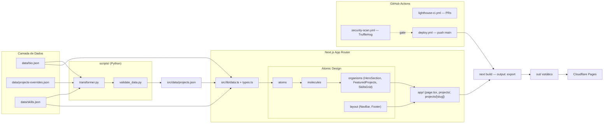

<!-- Criado em: 11/08/2026 16:30 -->
<!-- Modificado em: 22/08/2026 12:41 -->

# yves-eti-br

Portfólio pessoal (**yves.eti.br**), **Next.js 16.3 (App Router) + TypeScript + Tailwind 4.3**, Node.js **22 LTS**, com `output: "export"` (build 100% estático) hospedado no **Cloudflare Pages**. Estrutura em Atomic Design (`src/components/atoms|molecules|organisms|layout`). Conteúdo dirigido por dados: `data/bio.json`, `src/data/projects.json`, `data/skills.json`, `data/experience.json`, `data/education.json`, lidos via `src/lib/data.ts` e tipados em `src/lib/types.ts`.

## Arquitetura (fluxo de dados → deploy)

Camadas: dados brutos (`data/*.json`, curados manualmente + scan do `portfolio-generator`) → pipeline Python (`transformer.py`/`validate_data.py`, com testes pytest) → `src/data/projects.json` consumido em build-time → componentes Atomic Design → SSG estático → Cloudflare Pages. CI (`security-scan.yml`) é gate obrigatório do `deploy.yml` via `needs`; `lighthouse-ci.yml` audita PRs sem bloquear merge (sem branch protection no plano Free).

## Decisões arquiteturais/técnicas duráveis

- Repositório **privado** no plano GitHub Free — **GitHub Advanced Security não pode ser habilitado** (API retorna `"Advanced security has not been purchased"`), então CodeQL e Dependency Review foram removidos do CI; segurança de código fica só com secret-scan (TruffleHog).
- CI/CD: `deploy.yml` (build + deploy Cloudflare Pages via `wrangler-action@v3`) só roda em push para `main`; depende (`needs`) de um job `security-scan` que reusa `security-scan.yml` via `workflow_call`, então falha de secret-scan bloqueia o deploy.
- `security-scan.yml` roda só o job `secret-scan` (TruffleHog `--only-verified`); falsos positivos são excluídos via `.github/trufflehog-excludes.txt` (não desabilitar o scan inteiro).
- Sem branch protection configurada no `main` (recurso pago indisponível no plano) — merges de PR não são bloqueados por checks falhando, só por disciplina manual.
- Node.js fixado via `.nvmrc` + `engines.node` no `package.json`: migrado de 22→24 em 2026-08-21, revertido de volta para **22 LTS** em 2026-08-22 (decisão do usuário — preferência por LTS já consolidada em vez da mais recente). Actions `actions/checkout`/`actions/setup-node` em `v7` (v4 embarcava Node 20 deprecado, gerava warning em todo run).
- CSS global (`src/app/globals.css`) usa a sintaxe do Tailwind v4: `@import "tailwindcss";` — **não** as diretivas antigas `@tailwind base/components/utilities` do v3 (ver "Problemas relevantes resolvidos" — usar a sintaxe errada quebra silenciosamente quase todas as classes utilitárias, sem erro de build).
- SEO: `metadataBase` no `layout.tsx` raiz, `alternates.canonical` por página, `robots.ts`, imagem OG/Twitter gerada dinamicamente via `next/og` (`opengraph-image.tsx`, sem asset estático — usa os tokens de marca do site), JSON-LD `schema.org/Person` populado a partir de `bio.json`. Como o build é estático, `opengraph-image.tsx` precisa de `export const dynamic = "force-static"` e a URL correta no JSON-LD é `/opengraph-image` (sem extensão — Next exporta o arquivo sem extensão no `output: export`).
- `sitemap.ts` usa `last_modified` real de cada projeto (`Project.last_modified`) e `generated_at` do catálogo em vez de `new Date()` fixo — evita "lastmod sempre agora" no build.
- `bio.json` tem campos `summary`, `philosophy` (filosofia de engenharia) e `methodology` (lista de práticas — arquitetura em camadas/DDD leve, execução orientada a objetivo, mudanças cirúrgicas, Documentação como Código, testes com cobertura mínima 95%, quality gates, fail-fast/graceful degradation), todos renderizados na `HeroSection`.
- Fluxo de merge sempre via PR + `./scripts/git-commit-with-file.sh` (ou `git commit -F`); hook local bloqueia commit direto em `main`/`master`.

## Problemas relevantes resolvidos

- PRs #25 e #26 foram fechados por um evento externo não identificado (não foi ação do usuário nem desta sessão) — o evento `pull_request` do GitHub também parou de disparar automaticamente para o PR #26 após o primeiro push (confirmado: `workflow_dispatch` funcionava normalmente, só o evento automático falhava). Fechar/reabrir o PR resolveu — o merge de conteúdo (bio) só chegou em produção depois de reabrir e mergear manualmente; deploy "com sucesso" no CI não implica que o conteúdo esperado está em `main`, sempre conferir se o PR realmente foi mergeado.
- TruffleHog reportou um falso positivo **verificado** (detector "Lob") em `tests/test_template_patches.py`/`tests/test_template_migration.py` — são fixtures de teste sem segredo real, confirmado pelo usuário; resolvido com `--exclude-paths` apontando para esses arquivos, não com supressão geral do scanner.
- `pnpm-lock.yaml`/`pnpm-workspace.yaml` apareceram como untracked por engano (rodei `pnpm exec tsc` numa sessão) — o projeto usa **npm** (`package-lock.json` versionado, `npm ci` nos workflows); removidos e adicionados ao `.gitignore` para não recorrer.
- `graphify-out/` é saída gerada pelo próprio Graphify (o `.graphifyignore` do repo já o exclui da própria reanálise, para evitar ciclo) — deve ir para `.gitignore`, não ser versionado.
- **Home em produção renderizando só o header (2026-08-22)**: `globals.css` ainda usava as diretivas `@tailwind base/components/utilities` (sintaxe Tailwind v3) depois da migração para `tailwindcss@^4.3.3` — o build não falhava, mas o Tailwind v4 não gerava quase nenhuma classe utilitária. Efeito: ícones SVG sem `h-4 w-4` renderizavam no tamanho intrínseco do viewBox (~1200px) e o menu mobile (`max-h-0`/`overflow-hidden`) nunca colapsava, esticando o `<header>` a ~2460px e empurrando todo o conteúdo para baixo da dobra. Corrigido trocando pelas 3 diretivas por `@import "tailwindcss";` (PR #40). Diagnóstico: build local + `npx serve` + Playwright headless para medir `getBoundingClientRect()` do header antes/depois — mudança visual não aparece em `curl`/diff de HTML, só em renderização real.
- **Erro de hidratação React #418 em produção**: causado pelo Cloudflare "Email Address Obfuscation" (Scrape Shield), que reescreve o `mailto:` do Footer no HTML *depois* do SSR do Next.js, gerando mismatch entre o texto que o React espera hidratar e o que o Cloudflare já entregou. Não afetava layout, só poluía o console. Resolvido desativando o setting via API (`PATCH /zones/{zone_id}/settings/email_obfuscation {"value":"off"}`) usando a Global API Key em `.secrets/cloudflare-master.json` (`global_api_token.api_token`, 37 chars — autenticar com headers `X-Auth-Email`+`X-Auth-Key`, não `Authorization: Bearer`; o token `origine_api_token` é outra credencial, não testada). `.secrets/cloudflare.json` (zone_id/api_token) só tinha placeholders — não usar esse arquivo sem antes confirmar se foi preenchido.

## Pendências / próximos passos conhecidos

- ~~Dependabot mantém PRs abertos recorrentes para `next`~~ — feito: upgrade Next 15→16, React 18→19, Tailwind 3→4, postcss 8.5.26 mergeados em 2026-08-22 (PRs #35–#40).
- **Investigar por que os dados do portfólio não foram atualizados** (aberto em 22/08/2026, registrado também em `docs/TODO.md` do repo) — último scan do `portfolio-generator` está em `f2e6836` (21/08/2026), mas o conteúdo exibido no site não reflete a atualização esperada; suspeitar de falha silenciosa em `scripts/transformer.py`/`validate_data.py` ou etapa do pipeline não executada. Ver também o precedente do PR #26 (deploy "com sucesso" não implica conteúdo em produção).
- Sem branch protection / status checks obrigatórios — risco de merge acidental de PR quebrado, já que nada bloqueia no GitHub (só disciplina manual).
- GHAS segue indisponível — se o usuário assinar futuramente, reavaliar reintroduzir CodeQL e Dependency Review no CI (removidos em 2026-08-11).
