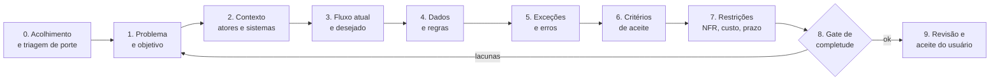

# Questionário de descoberta — Novo produto (automação de IA dirigida por especificação)

> **criado_em**: "27/09/2026 17:40" | modificado_em: "28/09/2026 10:05"
> **Status:** RASCUNHO v1 — aguardando respostas.
> **Base:** `objetivo-init-schema-v2.json` e `proposta-atualizacao-objetivo-init.md` (pasta do projeto).
> **Destino das respostas:** preencher o `objetivo-init` v2 do próprio produto (fase 0 — especificação).

---

## 0. Como usar este questionário

### 0.1 O que já sabemos (ponto de partida)

Da mensagem inicial:

1. Produto de **automação com IA**, com implantação **on-premise e cloud**.
2. Baseado em **desenvolvimento dirigido por especificação** (spec-driven development).
3. Público: **pessoas leigas em especificação** que querem usar IA para resolver demandas **de qualquer tamanho**.
4. Porta de entrada: uma **interface consultora** que levanta todas as informações, **debate cada etapa** da demanda e só termina quando existe uma especificação completa.

### 0.2 A observação que organiza tudo

O `objetivo-init` v2 que já existe na pasta é, na prática, **o formato de saída natural do consultor**. O schema já define o que é uma especificação "completa" (`spec_validation.definition_of_ready`), quais campos são obrigatórios e quais lacunas viram `GAP`, `ASM` ou `Q`. Isso significa que o produto pode ser descrito como:

> **Um entrevistador que conduz um leigo até um `objetivo-init` v2 válido, passando no gate de `spec_validation`, e (opcionalmente) executa o que foi especificado.**

Várias perguntas abaixo testam essa hipótese (ver **B-01** e **E-01**). Se ela for aceita, o questionário deste documento é ao mesmo tempo:

- a especificação do **produto**; e
- o primeiro rascunho do **roteiro de entrevista** que o consultor fará com os usuários dele.

### 0.3 Convenções

Cada pergunta tem:

| Campo                 | Significado                                                                                                                |
| --------------------- | -------------------------------------------------------------------------------------------------------------------------- |
| **ID**                | `X-nn`, onde `X` é o bloco. Ao registrar no `objetivo-init`, perguntas não respondidas viram `Q-nnnn` em `open_questions`. |
| **Prioridade**        | 🔴 bloqueia a fase 0 · 🟠 bloqueia a arquitetura · 🟡 pode ser respondida durante o MVP · 🟢 pode esperar                  |
| **Por que importa**   | O que muda no produto conforme a resposta.                                                                                 |
| **Opções / sugestão** | Alternativas conhecidas. ⭐ marca a minha recomendação inicial, que vira `assumptions` (`ASM`) se você não responder.       |
| **Campo v2**          | Caminho no `objetivo-init` v2 onde a resposta será gravada.                                                                |

Forma de responder: pode escrever direto abaixo de cada pergunta (preenchendo a linha `**Resposta:**` que já está abaixo de cada uma), responder por ID no chat (`A-03: ...`) ou só dizer "aceito a recomendação" para um bloco inteiro. Respostas "não sei" são válidas: viram premissa com dono e prazo, que é exatamente o que a proposta v2 pede (A-05).

### 0.4 Índice dos blocos

| Bloco | Tema                                                    | Perguntas | 🔴  |
| ----- | ------------------------------------------------------- | --------- | --- |
| A     | Visão, problema e objetivos                             | 10        | 5   |
| B     | Escopo do produto e limites                             | 10        | 5   |
| C     | Público-alvo e personas                                 | 9         | 3   |
| D     | O consultor: fluxo de entrevista e debate               | 16        | 6   |
| E     | Modelo de especificação (artefato de saída)             | 12        | 5   |
| F     | Execução e automação pós-especificação                  | 10        | 3   |
| G     | Domínio do próprio produto (`domain_spec`)              | 8         | 2   |
| H     | Arquitetura, implantação on-premise e cloud             | 16        | 5   |
| I     | Modelos de IA, orquestração e custo                     | 14        | 4   |
| J     | Segurança, privacidade e conformidade (LGPD)            | 13        | 4   |
| K     | Requisitos não funcionais                               | 10        | 2   |
| L     | Negócio, monetização e concorrência                     | 12        | 3   |
| M     | MVP, fases e métricas de sucesso                        | 8         | 3   |
| N     | Equipe: skills e recursos                               | 11        | 3   |
| O     | Governança da especificação (pendências da proposta v2) | 7         | 2   |

Total: **166 perguntas**, das quais **55 são 🔴 bloqueantes** da fase 0. Sugestão de ordem: A → B → C → D → E → M, depois o resto.

---

## A. Visão, problema e objetivos

> Campo v2: `specification.project_name`, `specification.description`, `specification.objetivos[]`, `expected_outcome.success_criteria[]`

**A-01 🔴 Nome do produto (provisório ou definitivo)?**
- Por que importa: vira `project_name`, prefixo de pacotes Python, nome de imagens Docker, namespace Kubernetes e domínio.
- Relação: a proposta v2 cita o **PraxisForge**. Este produto **é** o PraxisForge, é um produto irmão, ou o PraxisForge é o motor interno que este produto usa?
- Opções: (a) é o próprio PraxisForge · (b) produto novo que usa o PraxisForge como motor · (c) produto novo sem relação.
- Campo v2: `specification.project_name`

**Resposta:**  nome provisório "consulta-ai.ia.br"

**A-02 🔴 Em uma frase, qual problema o produto resolve?**
- Formato sugerido: "Pessoas que ___ não conseguem ___ porque ___; o produto permite ___."
- Sugestão de rascunho: "Pessoas sem formação técnica não conseguem usar IA para resolver demandas reais porque não sabem descrever o problema com precisão suficiente; o produto conduz uma conversa guiada que transforma a ideia em especificação verificável e, a partir dela, em solução automatizada."
- Campo v2: `specification.description`

**Resposta:**  sugestão aprovada.

**A-03 🔴 Qual é a dor principal hoje, observada na prática?**
- Exemplos: a pessoa pede algo vago ao ChatGPT e recebe algo errado; contrata um freelancer e o resultado não é o esperado; o projeto estoura prazo por requisito mal definido; a IA "inventa" o que não foi dito.
- Por que importa: define qual métrica de sucesso é a correta (retrabalho? tempo até a primeira entrega útil? taxa de aceite?).
- Pergunta complementar: você tem casos reais (seus ou de clientes) que possam virar cenários de teste do consultor?

**Resposta:**  O exemplo está correto, adicionar ao exemplo problemas de segurança e custo elevado.
**Caso:** Empresa de Contabilidade tem de digitar todas Notas Fiscais em seus sistemas, além de analisar e separar as informações de impostos. isso envolve várias etapas manuais.

**A-04 🔴 Quais são os 3 a 5 objetivos do produto?**
- Cada objetivo vira `OBJ-nn` com `statement` e `rationale`.
- Sugestão inicial (⭐ vira ASM se não responder):
  - `OBJ-01` Permitir que um leigo produza uma especificação completa sem conhecer o formato.
  - `OBJ-02` Reduzir lacunas de especificação antes da execução (detectar o que não foi dito).
  - `OBJ-03` Executar ou encaminhar a solução a partir da especificação validada.
  - `OBJ-04` Funcionar igualmente em cloud e on-premise (inclusive sem internet).
  - `OBJ-05` Manter rastreabilidade de ponta a ponta (pedido → especificação → entrega).
- Campo v2: `specification.objetivos[]`

**Resposta:**  OBJ-01 + OBJ-02 + OBJ-04 + OBJ-05. Produto no formato on-premise para empresas grandes com políticas de segurança elevada. Cloud para empresas que precisão de segurança mas não tem estrutura própria. Eliminar o vibe coding descontrolado dentro das empresas. Agilizar o processo de desenvolvimento de soluções demandas tecnologicas dentro das empresas.

**A-05 🔴 Como saberemos que cada objetivo foi atingido (métrica, alvo e forma de medir)?**
- Exemplos por objetivo:
  - OBJ-01: % de sessões que chegam a uma spec que passa no gate (`spec_validation`) · alvo ≥ 70% · medido por evento `spec.validated` no log.
  - OBJ-02: nº médio de `GAP` descobertos **depois** da validação · alvo < 1 por spec.
  - OBJ-03: % de specs que viram entrega aceita pelo usuário.
  - Tempo mediano da primeira mensagem até a spec validada, por porte de demanda.
- Campo v2: `expected_outcome.success_criteria[]` (`metric`, `target`, `measured_by`)

**Resposta:**  OBJ-01

**A-06 🟠 Qual é a visão de 3 anos?** Ferramenta pessoal, produto comercial para PMEs, plataforma para consultorias/integradores, produto enterprise?
- Por que importa: muda multi-tenancy (H), licenciamento (L) e o módulo RBAC (J-05).

**Resposta:**  Ferramenta pessoal, produto comercial para PMEs, produto enterprise. RBAC 100%

**A-07 🟠 Por que agora?** O que mudou (custo de LLM, modelos locais bons, agentes, adoção de SDD) que torna o produto viável hoje e não há dois anos?

**Resposta:** Identificamos uma oportunidade de negócios baseado em noticias do mercado que mostram o grande problema de utilização de vipe coding descontrolado.

**A-08 🟡 Qual é o diferencial em uma frase frente a "usar o ChatGPT/Claude direto"?**
- Hipótese: o diferencial é o **gate de completude** (a IA não executa enquanto a spec tem lacuna) + **rastreabilidade** + **on-premise**.

**Resposta:**  hipótese aprovada.

**A-09 🟡 Existe patrocinador, sócio ou cliente âncora?** Quem, e o que ele espera ver primeiro?

**Resposta:**  Nada em vista.

**A-10 🟢 Qual é a relação com os seus serviços atuais** (administração de Chatwoot, Typebot, n8n, Flowise, Botpress, Vtiger, Asterisk)? O produto será vendido junto, vai substituir algo, ou é independente?

**Resposta:**  Independente

---

## B. Escopo do produto e limites

> Campo v2: `specification.scope_boundary`, `specification.out_of_scope[]`, `specification.project_outputs[]`

**B-01 🔴 Até onde o produto vai?** Esta é a pergunta mais importante do documento.
- (a) **Só especificação**: entrega o documento; o usuário leva para quem quiser executar.
- (b) **Especificação + plano**: entrega spec, plano e tarefas prontas para um desenvolvedor ou agente.
- (c) ⭐ **Especificação + execução assistida**: gera a solução (código, fluxo n8n, bot, planilha, documento) com aprovação humana em cada etapa.
- (d) **Especificação + execução autônoma + operação**: implanta, monitora e mantém.
- Por que importa: (a) é um produto de conversa; (c) e (d) exigem sandbox, agentes, integrações, custo de IA muito maior e responsabilidade sobre o que foi executado.
- Recomendação: construir (a) como MVP, com arquitetura pronta para (c).

**Resposta:**  aprovo opção (c).

**B-02 🔴 O que significa "demanda de qualquer tamanho" na prática?** Dê um exemplo pequeno, um médio e um grande.
- Sugestão de escala (⭐):
  - **P**: tarefa única (ex.: "resumir e classificar os e-mails de reclamação por semana").
  - **M**: automação com integrações (ex.: "quando entrar lead no Typebot, cadastrar no Vtiger e avisar no WhatsApp").
  - **G**: sistema/projeto (ex.: "um sistema de agendamento para minha clínica").
- Por que importa: o consultor precisa dimensionar a profundidade da entrevista. Uma demanda P não pode exigir 166 perguntas.

**Resposta:**  O sistema deve solicitar ao usuário qual o tamanho da demanda com as 3 opções acima. Queremos atender vários tamanhos de empresas.

**B-03 🔴 Quais tipos de demanda estão dentro do escopo?** Marque:
- [ ] Automação de processos (fluxos, integrações entre sistemas)
- [ ] Desenvolvimento de software (scripts, APIs, sistemas)
- [ ] Chatbots e atendimento
- [ ] Análise de dados e relatórios
- [ ] Geração de documentos e conteúdo
- [ ] Infraestrutura (Docker, Kubernetes, Ansible, Terraform)
- [ ] Demandas não técnicas (plano de negócio, processo de RH, jurídico)
- Recomendação: começar com **automação de processos + scripts/software**, que é onde a spec gera algo executável e testável.

**Resposta:**  recomendação aprovada, porém as demais deverão ser atendidas.

**B-04 🔴 O que está explicitamente fora do escopo?** Cada item vira `out_of_scope[]` com `item` e `reason`.
- Sugestões: aconselhamento jurídico/médico/financeiro; execução em produção sem aprovação humana; operação contínua de sistemas do cliente (no MVP); demandas ilegais ou que violem política de uso dos modelos.

**Resposta:**  sugestão aprovada. app deve ter um cadastro com os escopos que podem ser atendidos, devido as várias formas de gerenciamento de segurança.

**B-05 🔴 Quais são as saídas do produto (`project_outputs`)?** Para cada uma: tipo, formato, schema.
- Sugestão: especificação (`objetivo-init` YAML, schema v2); relatório legível (Markdown/PDF); cenários de aceite (`.feature` Gherkin); diagrama de workflow (Mermaid); plano de tarefas (YAML); artefatos executáveis (se B-01 ≥ c).

**Resposta:**  sequência sugerida aprovada.

**B-06 🟠 O produto atende uma demanda por vez ou mantém um "projeto" com várias demandas que evoluem?** (Ex.: primeiro a automação de leads, depois o relatório semanal que usa os mesmos dados.)

**Resposta:**  por projeto. permitir colaboração entre usuários.

**B-07 🟠 O usuário pode voltar e alterar a especificação depois de validada?** Como fica o versionamento (nova versão, diff, reabertura do gate)?

**Resposta:**  nova versão.

**B-08 🟠 O produto deve importar material existente** (documento, planilha, print, áudio, e-mail, repositório Git) como ponto de partida da entrevista?

**Resposta:**  deve ter essa opção

**B-09 🟡 Idiomas:** só português do Brasil no MVP? Quando inglês/espanhol?

**Resposta:**  iniciar com protuguês.

**B-10 🟢 Haverá marketplace de modelos de especificação** (templates por setor: clínica, loja, escritório contábil)?

**Resposta:**  sim

---

## C. Público-alvo e personas

> Campo v2: `domain_spec.operational_workflow.actors`, `profile`

**C-01 🔴 Quem é o usuário principal?** Descreva 2 ou 3 personas.
- Sugestão (⭐):
  - **P1 · Dono de pequeno negócio**: sabe o problema, não sabe tecnologia, quer resultado.
  - **P2 · Analista de área (RH, financeiro, operações)**: domina o processo, tem acesso limitado a TI.
  - **P3 · Profissional técnico generalista (consultor, integrador, sysadmin)**: sabe executar, quer acelerar a especificação para clientes.
- Por que importa: P1 e P2 precisam de linguagem sem jargão; P3 quer ver o YAML.

**Resposta:**  todos os "P", objetivo é atender todos.

**C-02 🔴 Quem paga é o mesmo que usa?** (Ex.: a empresa paga, o analista usa; a consultoria paga, o cliente final responde as perguntas.)

**Resposta:**  a empresa é o cliente (paga), seu funcionário é o usuário. Planos pré e pós pagos.

**C-03 🔴 Qual é o nível mínimo de habilidade que o produto assume?** Sabe usar WhatsApp e navegador? Sabe o que é planilha? Sabe o que é API?

**Resposta:** essas habilidades dependem do usuário especificado em "C-01".

**C-04 🟠 Há usuários com papéis diferentes na mesma demanda?** (Solicitante, especialista de negócio, aprovador, executor técnico.) Se sim, a entrevista é colaborativa e isso puxa o módulo RBAC.

**Resposta:**  a entrevista é colaborativa. levar em consideração que as PME todos os papéis serão de um ou dois usuários.

**C-05 🟠 Quais setores/segmentos são alvo inicial?** (Saúde, varejo, serviços, contabilidade, educação, indústria, governo.) Setor regulado muda requisitos de J.

**Resposta:**  todos com exceção de governo.

**C-06 🟡 Tamanho de empresa alvo:** MEI, pequena, média, grande?

**Resposta:**  todos

**C-07 🟡 Canais em que o usuário prefere conversar:** web, app, WhatsApp, Telegram, voz? (Relaciona com Chatwoot/Typebot que você já administra.)

**Resposta:** possivel utilização com Chatwoot.

**C-08 🟡 Necessidades de acessibilidade:** leitor de tela, voz em vez de texto, baixa escolaridade?

**Resposta:** não definido.

**C-09 🟢 Há um perfil de usuário que o produto deve recusar ou redirecionar?** (Ex.: demanda grande demais para o plano contratado.)

**Resposta:** o perfil é o tipo de plano. pós pago não tem limites.

---

## D. O consultor: fluxo de entrevista e debate

> Campo v2: `domain_spec.operational_workflow.activities[]`, `domain_spec.business_rules[]`, `domain_spec.decision_tables[]`
> Este é o coração do produto. Cada resposta aqui vira atividade (`ACT`), regra (`BR`) ou tabela de decisão (`DT`).

**D-01 🔴 Quais são as etapas da consultoria?** Proposta (⭐):

- Pergunta: concorda com as etapas? Falta alguma? Alguma é opcional para demanda P?

**Resposta:**  concordo

**D-02 🔴 O que é "debater cada etapa"?** Escolha o comportamento:
- (a) O consultor só pergunta e registra.
- (b) ⭐ O consultor pergunta, **propõe alternativas com prós e contras**, recomenda uma e pede confirmação.
- (c) O consultor **contesta** respostas inconsistentes ou arriscadas (advogado do diabo).
- (d) (b) + (c).
- Por que importa: (c) exige detecção de contradição e um tom calibrado; mal feito, irrita o leigo.

**Resposta:**  d

**D-03 🔴 Qual é o critério de parada?** Quando o consultor declara que a especificação está completa?
- Sugestão (⭐): quando a spec passa na `definition_of_ready` do schema v2 **para o porte da demanda** + o usuário aceita o resumo final.
- Pergunta complementar: o usuário pode forçar a conclusão com lacunas? Se sim, as lacunas viram `ASM` com aviso de risco?

**Resposta:**  sugestão aprovadas com lacunas e registro do "Aceite" do usuário.

**D-04 🔴 Como o consultor lida com "não sei"?**
Opções: 
- (a) insiste com exemplos; 
- (b) ⭐ oferece opções com recomendação e, se persistir, registra `ASM` com risco; 
- (c) marca `Q` e segue; 
- (d) sugere consultar outra pessoa e pausa a sessão.

**Resposta:**  (b)

**D-05 🔴 Como o consultor evita perguntas demais?** Leigos abandonam longas entrevistas.
- Estratégias possíveis: triagem de porte (B-02); inferir do contexto e só confirmar; perguntas em lote por etapa; defaults inteligentes por setor; mostrar progresso (%); permitir pausar e retomar.
- Pergunta: qual é o limite aceitável de tempo/perguntas por porte? Sugestão: P ≤ 10 min, M ≤ 30 min, G em várias sessões.

**Resposta:**  Seguir nível do cliente em C-01

**D-06 🔴 Como o consultor traduz para o leigo e de volta para a spec?**
- O usuário nunca vê `ENT-01` ou `BR-03`? Vê um "resumo em linguagem natural" e, opcionalmente, a spec técnica?
- Sugestão (⭐): duas visões da mesma spec: **visão leiga** (texto + diagrama simples) e **visão técnica** (YAML + Gherkin), sempre sincronizadas.

**Resposta:** sugestão aprovada.

**D-07 🟠 O consultor usa exemplos concretos para validar?** (Ex.: "Se chegar um lead às 23h num domingo, o que acontece?") Técnica de *specification by example*: cada exemplo confirmado vira cenário Gherkin.

**Resposta:** usar técnica de *specification by example*

**D-08 🟠 Detecção de contradição e ambiguidade:** o consultor deve apontar quando uma resposta contradiz outra anterior? Com que técnica (checklist 29148, revisão por segundo modelo, regras determinísticas)?

**Resposta:** checklist 29148

**D-09 🟠 Revisão adversarial:** um segundo agente ("revisor") deve atacar a spec antes do gate, procurando lacunas? (Técnica `adversarial_ai_review` já prevista em `spec_validation.techniques`.)

**Resposta:** sim

**D-10 🟠 Persistência da conversa:** o usuário pode pausar e voltar dias depois? Em outro dispositivo? O consultor deve lembrar de demandas anteriores do mesmo usuário (memória de longo prazo)?

**Resposta:** pode pausar e continuar depois, independente do dispositivo. memorizar os projetos.

**D-11 🟠 Entrada multimodal:** aceitar áudio (transcrição), imagem (print de tela, foto de formulário), planilha, PDF? Qual prioridade?

**Resposta:**  imagem, planilha, arquivos textos(CSV), pdf, mermaid.

**D-12 🟠 Escalonamento para humano:** existe um consultor humano que pode assumir a conversa? Quando (demanda G, usuário travado, pedido explícito)? (Chatwoot é candidato natural para esse handoff.)

**Resposta:** usuário pode pedir ajuda de Consultor N2, IA especializada ou humano.

**D-13 🟡 Personalidade e tom:** formal, próximo, técnico? Nome e avatar do consultor?

**Resposta:** formal, próximo, técnico baseado em C-01, com nome e avatar condizente com C-01

**D-14 🟡 Roteiros por setor:** o consultor deve ter "playbooks" por tipo de demanda (automação de atendimento, relatório, sistema de cadastro) com perguntas pré-definidas?

**Resposta:** sim

**D-15 🟡 Explicabilidade:** o usuário pode perguntar "por que você está me perguntando isso?" e receber a justificativa (qual campo da spec a pergunta preenche)?

**Resposta:** sim, pode pedir ajuda para entendimento.

**D-16 🟢 Colaboração em tempo real:** duas pessoas respondendo a mesma entrevista simultaneamente?

**Resposta:** Nesse momento não. Funcionalidade futura.

---

## E. Modelo de especificação (artefato de saída)

> Campo v2: `specification.project_outputs[]`, `spec_validation`, `traceability`

**E-01 🔴 O `objetivo-init` v2 é o formato de saída do produto?**
- (a) ⭐ Sim, para demandas M e G. Para demandas P, um **subconjunto** ("perfil leve") validado por um schema derivado.
- (b) Sim, sempre completo.
- (c) Não; criar um formato próprio mais simples e converter para v2 quando necessário.
- Por que importa: o schema atual exige `architecture`, `folder_structure`, `infrastructure` e outros blocos que não fazem sentido para "resumir e-mails semanalmente".

**Resposta:** (a)

**E-02 🔴 Se houver perfis por porte, quais blocos são obrigatórios em cada um?** Sugestão (⭐):

| Bloco v2                                             | P              | M                | G   |
| ---------------------------------------------------- | -------------- | ---------------- | --- |
| `objetivos`, `description`, `out_of_scope`           | ✅              | ✅                | ✅   |
| `domain_spec.glossary`, `entities`                   | opcional       | ✅                | ✅   |
| `operational_workflow`                               | simplificado   | ✅                | ✅   |
| `business_rules`, `decision_tables`                  | se houver      | ✅                | ✅   |
| `functional_requirements` + cenários                 | ≥1 pos./1 neg. | ✅                | ✅   |
| `non_functional_requirements`                        | opcional       | ✅                | ✅   |
| `architecture`, `folder_structure`, `infrastructure` | ❌              | se gera software | ✅   |
| `assumptions`, `open_questions`, `gaps`              | ✅              | ✅                | ✅   |

**Resposta:** sugestão aprovada.

**E-03 🔴 A proposta v2 já foi aplicada?** As decisões **D-1 a D-7** da proposta (seção 6) foram respondidas? O schema v2 na pasta é a versão aprovada ou ainda é proposta? (Ver bloco O.)

**Resposta:** versão aprovada, passível de revisão.

**E-04 🔴 O gate de validação é determinístico, por IA, ou ambos?**
- Sugestão (⭐): **ambos**. `spec-lint` determinístico (JSON Schema + integridade de IDs + placeholders remanescentes) é obrigatório e bloqueante; revisão por IA é consultiva e gera `GAP` candidatos que o usuário confirma.

**Resposta:** sugestão aprovada.

**E-05 🔴 Quem aprova a spec final?** O próprio usuário? Um aprovador separado (C-04)? Assinatura/aceite registrado com data e versão?

**Resposta:** depende do cadastro da Empresa com papel de aprovador.

**E-06 🟠 Formato de armazenamento:** YAML como fonte da verdade + `docs/spec/` (decisão D-2 da proposta), ou banco de dados como fonte e YAML como exportação?
- Por que importa: numa aplicação multiusuário, a fonte natural é o banco (PostgreSQL com JSONB validado pelo schema); o YAML vira artefato exportado e versionado.

**Resposta:** banco (PostgreSQL com JSONB validado pelo schema); o YAML vira artefato exportado e versionado.

**E-07 🟠 Versionamento da spec:** cada alteração gera versão (semver da spec? hash?), com diff legível para o leigo?

**Resposta:** mesmo padrão github

**E-08 🟠 Cenários de aceite em Gherkin:** em português (`# language: pt`, "Dado / Quando / Então") para o leigo ler e aprovar?

**Resposta:** português inicialmente. 

**E-09 🟠 Exportação:** quais formatos? Markdown, PDF, DOCX, YAML, JSON, repositório Git com `docs/spec/`, issue no GitHub/GitLab, card no Trello/Jira?

**Resposta:** Markdown, PDF, DOCX, YAML, JSON, repositório Git com `docs/spec/`, issue no GitHub/GitLab

**E-10 🟡 Templates de domínio reutilizáveis:** a spec pode herdar de um template (ex.: "atendimento WhatsApp com Chatwoot") que já traz entidades e regras padrão?

**Resposta:** sim

**E-11 🟡 Métrica de qualidade da spec:** mostrar ao usuário um "índice de completude" (ex.: 82%, faltam 3 regras de exceção)?

**Resposta:** sim

**E-12 🟢 Spec como contrato comercial:** a spec aprovada pode servir de escopo contratual entre o usuário e um executor terceiro?

**Resposta:** sim, opicional

---

## F. Execução e automação pós-especificação
**IMPORTANTE** a execução e automação é módulo separado do Consultor. Respostas devem ser ignoradas.

> Só se aplica se B-01 for (c) ou (d). Campo v2: `features_to_implement[]`, `pending_tasks`, `modules`

**F-01 🔴 Quem executa a spec?**
- (a) Agentes de IA do próprio produto (geram código, fluxos, configurações).
- (b) Plataformas existentes que o produto configura: ⭐ **n8n**, Airflow, Flowise, Typebot, Botpress.
- (c) Desenvolvedores humanos (marketplace ou equipe interna).
- (d) Combinação, decidida por tipo de demanda.

**Resposta:**  

**F-02 🔴 Onde o resultado roda?** No ambiente do cliente (on-premise), na nuvem do produto, ou é entregue como pacote (repositório, `docker compose`, Helm chart)?

**Resposta:** 

**F-03 🔴 Nível de autonomia e aprovação humana:** o que exige aprovação explícita antes de executar? Sugestão (⭐): toda ação com efeito externo (enviar mensagem, gravar em sistema do cliente, gastar dinheiro, implantar) exige aprovação; geração em sandbox não exige.

**Resposta:** 

**F-04 🟠 Sandbox:** a execução gerada roda em sandbox isolado (container efêmero, gVisor, Firecracker, namespace Kubernetes dedicado) antes de ir para o ambiente real?

**Resposta:** 

**F-05 🟠 Testes automáticos a partir da spec:** os cenários Gherkin viram testes (`pytest-bdd`, como a proposta sugere) que rodam contra o resultado antes da entrega?

**Resposta:** 

**F-06 🟠 Integrações prioritárias:** quais sistemas o produto precisa saber integrar primeiro? (Vtiger, Chatwoot, WhatsApp, Google Workspace, Microsoft 365, ERPs, bancos MySQL/PostgreSQL, planilhas.)

**Resposta:** 

**F-07 🟠 Credenciais do cliente:** como o produto recebe e guarda credenciais dos sistemas do cliente (vault, secrets do Kubernetes, nunca guardar)?

**Resposta:** 

**F-08 🟡 Operação contínua:** o produto monitora a automação depois de entregue (falhas, custo, drift)? Quem é avisado?

**Resposta:** 

**F-09 🟡 Manutenção:** quando o processo do cliente muda, o usuário volta ao consultor, altera a spec e o produto regenera a solução (ciclo spec → código sempre sincronizado)?

**Resposta:** 

**F-10 🟢 Rollback:** como desfazer uma automação implantada?

**Resposta:** 

---

## G. Domínio do próprio produto (`domain_spec`)

> Campo v2: `domain_spec.glossary`, `entities`, `crud_matrix`, lifecycle em `docs/spec/states/`

**G-01 🔴 Validar o glossário inicial** (linguagem ubíqua do produto). Proposta (⭐):

| Termo                 | Definição                                                     | Não confundir com                |
| --------------------- | ------------------------------------------------------------- | -------------------------------- |
| Demanda               | Necessidade trazida pelo usuário, em linguagem livre          | Requisito (derivado da demanda)  |
| Sessão de consultoria | Conversa entre usuário e consultor sobre uma demanda          | Sessão de login                  |
| Etapa                 | Fase da consultoria (D-01)                                    | Atividade do workflow do cliente |
| Especificação         | Artefato versionado que descreve a solução (objetivo-init v2) | Plano (derivado da spec)         |
| Lacuna (GAP)          | Informação necessária e ausente                               | Premissa                         |
| Premissa (ASM)        | Informação assumida sem confirmação, com dono e prazo         | Fato confirmado                  |
| Pergunta aberta (Q)   | Dúvida registrada que bloqueia requisitos                     | Pergunta da entrevista           |
| Gate                  | Verificação que impede avançar com a spec incompleta          | Aprovação do usuário             |
| Execução              | Transformação da spec validada em solução                     | Implantação                      |
| Workspace/Organização | Agrupamento de usuários e demandas (se multi-tenant)          | Projeto                          |

**Resposta:** proposta aprovada.

**G-02 🔴 Validar as entidades principais:** Usuário, Organização, Demanda, Sessão, Mensagem, Etapa, Especificação (e Versão), Requisito, Cenário, Lacuna, Premissa, Pergunta aberta, Aprovação, Execução, Artefato, Integração/Credencial, Plano/Assinatura. Falta alguma? Alguma sobra no MVP?

**Resposta:** Não

**G-03 🟠 Ciclo de vida da Demanda:** proposta `rascunho → em consultoria → em validação → especificada → aprovada → em execução → entregue → encerrada`, com `pausada` e `cancelada`. Concorda? Estados finais?

**Resposta:** `rascunho → em consultoria → em validação → especificada → aprovada  entregue → encerrada`, com `pausada` e `cancelada`.

**G-04 🟠 Ciclo de vida da Especificação:** `rascunho → validada (gate) → aprovada → substituída`. Uma spec aprovada pode ser editada ou só substituída por nova versão?

**Resposta:** ciclo proposta aprovado. pode ser editada com nova aprovação.

**G-05 🟠 Retenção (o "D" da matriz CRUD):** por quanto tempo guardar conversas, specs, artefatos e logs? O usuário pode excluir tudo (LGPD, direito de eliminação)? Specs excluídas somem ou são anonimizadas?

**Resposta:** tempo indeterminado enquanto serviço consultor ativo. após encerramento do serviço exportação de dados para o cliente e exclusão permanente.

**G-06 🟡 Regras de negócio conhecidas:** exemplos a confirmar:
- BR: uma demanda só entra em execução com spec aprovada e gate verde.
- BR: premissa crítica aberta bloqueia aprovação.
- BR: execução com efeito externo exige aprovação humana registrada.
- BR: demanda acima do limite do plano exige upgrade ou atendimento humano.

**Resposta:** Esse módulo não faz execução. exclusivamente para especificação.

**G-07 🟡 Auditoria:** quais ações precisam de trilha de auditoria imutável (aprovação, execução, alteração de spec, acesso a credenciais)?

**Resposta:**  N/A

**G-08 🟢 Métricas de domínio a coletar desde o início:** duração por etapa, nº de perguntas, nº de lacunas por etapa, taxa de abandono por etapa, custo de IA por sessão.

**Resposta:** todos os propostos acima.

---

## H. Arquitetura, implantação on-premise e cloud

> Campo v2: `specification.architecture`, `infrastructure`, `specification.configuration`, `modules`

**H-01 🔴 On-premise e cloud usam o mesmo código e a mesma imagem?**
- ⭐ Recomendação: sim, um único artefato (imagens OCI) com diferenças apenas por configuração e módulos (`modules.*.enabled`).

**Resposta:**  recomendação aprovada

**H-02 🔴 Qual é o alvo de implantação on-premise?**
- (a) `docker compose` num único host (PME).
- (b) Kubernetes (Helm chart) para clientes maiores.
- (c) ⭐ Ambos: compose para até N usuários, Helm acima disso.
- (d) Appliance (VM pronta, OVA).

**Resposta:** (c)

**H-03 🔴 O on-premise precisa funcionar totalmente offline (air-gapped)?**
- Por que importa: se sim, os modelos de IA precisam rodar localmente (bloco I), atualizações são por pacote e a licença precisa de validação offline. É a pergunta que mais muda custo de hardware.

**Resposta:** Objetivo desse produto para venda on-premise é a especificação da infra necessária. O restante é responsabilidade da Empresa Contratante. 

**H-04 🔴 Multi-tenancy na cloud:** isolamento por schema, por banco, por namespace ou por cluster? Um cliente enterprise pode pedir cloud dedicada?

**Resposta:** Modelo híbrido (decidido em 28/09/2026). Padrão *pool*: aplicação e PostgreSQL compartilhados, isolamento por `tenant_id` + Row-Level Security (`SET app.tenant_id` por transação; usuário da aplicação diferente do dono das tabelas ou `FORCE ROW LEVEL SECURITY`). Mesmo isolamento em pgvector (RLS), Redis/fila (prefixo `t:{tenant_id}:` e tenant no payload), arquivos MinIO/S3 (prefixo por tenant), Traefik (subdomínio por tenant, middleware injeta o tenant), limites de tokens e rate por tenant, `tenant_id` obrigatório no log. Enterprise: *silo* com stack compose ou VPS dedicada, mesma imagem e migrações (mesmo artefato do on-premise, H-01). Evitar schema por tenant e banco por tenant no mesmo servidor.

**H-05 🔴 Estilo arquitetural:** o `objetivo-init` já prevê camadas (Domain, Application, Infrastructure) e hexagonal. Confirma monólito modular no MVP (⭐) ou microsserviços desde o início?

**Resposta:** MVP

**H-06 🟠 Stack de backend:** Python (FastAPI/Litestar) ⭐, dado seu perfil? Workers assíncronos com Celery, Dramatiq, Arq ou Temporal? (Temporal combina bem com sessões longas de consultoria que pausam e retomam.)

**Resposta:** Usar a melhor prática e linguagens de mercado. não limitar ao Python.

**H-07 🟠 Frontend:** web (React/Vue/Svelte, HTMX)? App móvel? Canal WhatsApp via Chatwoot/Typebot como interface alternativa?

**Resposta:** Chatwoot preferencialmente. Typebot pode ser substituído por outra ferramenta mais apropriada que seja FOSS.

**H-08 🟠 Banco de dados:** PostgreSQL ⭐ (JSONB para specs + pgvector para busca semântica) ou MySQL? Precisa de cluster Percona desde o início ou só em enterprise?

**Resposta:** PostgreSQL

**H-09 🟠 Busca e memória semântica:** pgvector, OpenSearch (que você já administra) ou Qdrant/Weaviate? Para quê: busca em specs anteriores, templates, RAG sobre documentos do cliente.

**Resposta:** usar melhor solução de mercado FOSS

**H-10 🟠 Fila e eventos:** Redis, RabbitMQ, NATS, Kafka? Precisa de event sourcing para a trilha de auditoria da spec?

**Resposta:** Redis ou RabbitMQ, um dos dois que tenham capacidade de atender a demanda.

**H-11 🟠 Borda e rede:** Traefik ⭐ como ingress/reverse proxy nas duas modalidades? TLS automático (Let's Encrypt) na cloud e certificado do cliente on-premise?

**Resposta:** recomendado aprovado no cloud. on-premise o contrante toma suas decisões.

**H-12 🟠 Observabilidade:** Grafana + Loki/Prometheus/Tempo ⭐, ou OpenSearch para logs? Contrato de log JSON conforme `NFR-01` da proposta? Telemetria do on-premise volta para o fabricante (opt-in)?

**Resposta:** cloud usa o recomendado. on-premise o contrante toma suas decisões.

**H-13 🟠 Hierarquia de configuração:** aceitar a proposta A-13 (`.secrets/` → arquivo → env → parâmetros em banco)?

**Resposta:** sim

**H-14 🟡 Atualizações on-premise:** como o cliente recebe versões novas (registry privado, pacote offline, canal estável/beta)? Migrações de banco automáticas? Janela de manutenção?

**Resposta:** cliente on-premise recebe pacote offline. as ações necessárias para update estão no pacote. o cliente é responsável pela aplicação do update.

**H-15 🟡 Infraestrutura como código:** Terraform para a cloud e Ansible para on-premise ⭐? Quais provedores cloud (AWS, GCP, Azure, Hetzner, Magalu Cloud, OCI)? Região Brasil obrigatória?

**Resposta:** Ansilbe para os dois tipos.

**H-16 🟢 Requisitos mínimos de hardware on-premise** por porte, com e sem modelo local (ver I-03).

**Resposta:** Na documentação de instalação deve conter as especificações com degraus de tamanho de utilização. 
os modelos devem ser parâmetros configurados no Consultor, permitindo ampla gama de configurações.

---

## I. Modelos de IA, orquestração e custo

> Campo v2: `specification.architecture.ai_integration_standard`, `non_functional_requirements` (categoria `ai_cost`), `ai_safety_instructions`

**I-01 🔴 Quais provedores de IA na cloud?** Anthropic (Claude), OpenAI, Google, Mistral, Maritaca (pt-BR)? Um só ou vários com roteamento?
- ⭐ Recomendação: camada de abstração (adapter em Infrastructure, conforme regra A-08) com roteamento por tarefa: modelo forte para o consultor e para a revisão adversarial, modelo barato para classificação, resumo e extração.

**Resposta:** recomendação aprovada.

**I-02 🔴 Quais modelos locais no on-premise?** (Llama, Qwen, Mistral, Gemma, DeepSeek via Ollama, vLLM ou llama.cpp.) Qual qualidade mínima aceitável para o papel de consultor em português?
- Por que importa: o consultor exige raciocínio longo e bom português; modelos pequenos locais podem não atingir a qualidade. Pode ser necessário um modo híbrido (on-premise com IA na cloud, dados sensíveis mascarados).

**Resposta:** utilizar a mesma camada de abstração do I-01 para permitir utilização da forma que o cliente quiser.

**I-03 🔴 Modos de IA suportados no on-premise:**
- (a) Somente local (air-gapped).
- (b) Somente cloud (dados saem para o provedor).
- (c) ⭐ Híbrido configurável por cliente e por tipo de dado.

**Resposta:** (c)

**I-04 🔴 Limite de custo:** qual é o custo máximo de IA aceitável por sessão de consultoria, por porte? Quem paga o token (incluso no plano, repasse, BYOK — chave do próprio cliente)?

**Resposta:** a definir, possível configuração no cadastro do cliente no Consultor

**I-05 🟠 Orquestração de agentes:** framework próprio, LangGraph, Claude Agent SDK, CrewAI, Flowise (que você já administra)? Quantos agentes (consultor, revisor, redator da spec, executor)?

**Resposta:** Vander

**I-06 🟠 Saída estruturada:** o consultor escreve a spec por *tool use*/JSON validado contra o schema v2 a cada turno (⭐) ou gera texto livre e um segundo passo converte?

**Resposta:** recomendação aprovada.

**I-07 🟠 Versionamento de prompts:** prompts são artefatos versionados, com testes de regressão (conjunto de conversas de referência) antes de cada mudança?

**Resposta:** sim

**I-08 🟠 Avaliação (evals):** como medir se o consultor ficou melhor ou pior? Sugestão: conjunto de demandas-referência com spec "gabarito"; métrica de cobertura de lacunas; LLM-as-judge + revisão humana amostral.

**Resposta:** sugestão aprovada.

**I-09 🟠 RAG:** o consultor consulta base de conhecimento (templates, specs anteriores anonimizadas, documentação dos sistemas do cliente)?

**Resposta:** sim, prever parâmetro de conexão de KB.

**I-10 🟡 Fine-tuning:** há intenção de treinar/ajustar modelo próprio com as conversas? (Implicação direta em J: consentimento e anonimização.)

**Resposta:** sim, com segurança elevada.

**I-11 🟡 Fallback:** se o provedor cair ou o limite de custo estourar, o que acontece? Trocar de modelo, pausar a sessão, avisar o usuário?

**Resposta:**  depende do tipo de serviço contratado pelo cliente, pois o cliente pode fornecer sua API de acesso IA.

**I-12 🟡 Cache de prompt e de respostas:** usar prompt caching do provedor para o contexto fixo (schema, instruções) para reduzir custo?

**Resposta:** sim

**I-13 🟡 Proteção contra prompt injection:** documentos e mensagens do usuário podem tentar mudar o comportamento do consultor. Que nível de defesa (separação de canais, validação de saída por schema, bloqueio de ferramentas)?

**Resposta:** documentos não devem mudar comportamento, aplicar as melhores regras de segurança do mercado.

**I-14 🟢 Transparência:** o usuário vê qual modelo está sendo usado e quanto custou a sessão?

**Resposta:** em analise

---

## J. Segurança, privacidade e conformidade (LGPD)

> Campo v2: `ai_safety_instructions`, `non_functional_requirements`, `modules.rbac`

**J-01 🔴 Quais dados pessoais e sensíveis o produto vai tratar?** Conversas podem conter dados de clientes do usuário, dados de saúde, financeiros. Qual é a base legal (LGPD art. 7º/11)? O produto é **operador** e o cliente é **controlador**?

**Resposta:** O Agente deve bloquear o envio de informações sensíveis, com aviso ao usuário. O produto é **operador** e o cliente é **controlador**

**J-02 🔴 Dados podem sair do Brasil?** (Provedores de IA com processamento nos EUA.) Precisa de região Brasil, cláusulas contratuais, ou modo local obrigatório para certos dados?

**Resposta:** depende do tipo de contrato do cliente.

**J-03 🔴 Autenticação:** login próprio, OIDC/SAML (Keycloak, Google, Microsoft), LDAP (OpenLDAP ⭐ no on-premise, que você já administra)? MFA obrigatório?

**Resposta:** login próprio, com integração com Google, Microsoft e demais big techs. MFA obrigatório

**J-04 🔴 Os dados dos clientes podem ser usados para melhorar o produto?** (Treino, evals, templates.) Opt-in, opt-out, nunca?

**Resposta:** sim,sim.

**J-05 🟠 Módulo RBAC:** `modules.rbac.enabled` = true no produto? Papéis previstos (admin da organização, solicitante, especialista, aprovador, executor, auditor)? Multi-tenant hierárquico?

**Resposta:** sim

**J-06 🟠 Criptografia:** em trânsito (TLS 1.2+) e em repouso (disco, banco, backups)? Chaves gerenciadas pelo cliente no on-premise?

**Resposta:** sim, sim

**J-07 🟠 Gestão de segredos:** HashiCorp Vault/OpenBao, SOPS, secrets do Kubernetes? Como tratar credenciais do cliente usadas pela execução (F-07)?

**Resposta:** OpenBao

**J-08 🟠 Mascaramento de dados antes de enviar para IA na nuvem:** detectar e substituir CPF, e-mail, telefone, nomes (PII redaction) no modo híbrido?

**Resposta:** sim

**J-09 🟠 Sanitização de logs e histórico:** aplicar a regra A-09 da proposta (redação obrigatória + `gitleaks`/`detect-secrets`) também aos logs do produto?

**Resposta:** sim

**J-10 🟡 Certificações/normas desejadas:** ISO 27001, SOC 2, LGPD com DPO nomeado, requisitos de governo (se C-05 incluir setor público)?

**Resposta:** sim, setor privado.

**J-11 🟡 Backup e recuperação:** RPO/RTO na cloud? No on-premise, o backup é responsabilidade do cliente ou o produto oferece?

**Resposta:** Na cloud backup em AWS GCP. No on-premise, o backup é responsabilidade do cliente

**J-12 🟡 Política de uso aceitável:** o consultor deve recusar demandas ilícitas, de vigilância, fraude, spam? Como registrar a recusa?

**Resposta:** o consultor não deve aceitar nenhuma demanda ilícitas. sempre avisar e interromper o cliente.

**J-13 🟢 Pentest e bug bounty:** antes do lançamento? Periodicidade?

**Resposta:** sim na fase dev. na fase prod será definida um workflow para esse fim.

---

## K. Requisitos não funcionais

> Campo v2: `non_functional_requirements[]` (`id`, `category`, `statement`, `measured_by`)

**K-01 🔴 Latência do consultor:** tempo máximo aceitável até a primeira palavra da resposta (streaming) e até a resposta completa? Sugestão: primeira palavra < 2 s; resposta < 20 s.

**Resposta:** sugestão aceita.

**K-02 🔴 Escala inicial:** quantos usuários simultâneos e quantas sessões por dia no primeiro ano (cloud)? E num on-premise típico?

**Resposta:** até 100 usuários no cloud, faseados. on-premisse responsabilidade do cliente.

**K-03 🟠 Disponibilidade da cloud:** 99,5%? 99,9%? Janela de manutenção?

**Resposta:**  99% com janelas de manutenção sempre nos finais de semana, excepcionalmente durante os dias uteis.

**K-04 🟠 Contrato de log:** aceitar os campos obrigatórios da proposta (`timestamp, level, logger, layer, event, correlation_id, schema_version`) + `tenant_id`, `session_id`, `demand_id`, `model`, `tokens_in`, `tokens_out`, `cost`?

**Resposta:** sim

**K-05 🟠 Idempotência e retomada:** uma sessão interrompida (queda de rede, timeout do modelo) deve retomar exatamente do ponto, sem perder resposta nem duplicar pergunta?

**Resposta:** sim

**K-06 🟡 Navegadores e dispositivos suportados;** responsivo para celular?

**Resposta:** Chrome/Firefox/Apple/Microsoft. Computador.

**K-07 🟡 Acessibilidade:** WCAG 2.1 AA?

**Resposta:** Vander

**K-08 🟡 Internacionalização:** textos da interface externalizados desde o início (i18n), mesmo que só pt-BR no MVP?

**Resposta:** sim

**K-09 🟡 Portabilidade:** exportação completa dos dados do cliente (specs, conversas) em formato aberto, para evitar aprisionamento?

**Resposta:** sim

**K-10 🟢 Consumo de recursos no on-premise:** limite de CPU/RAM/GPU por componente?

**Resposta:** fazer especificação por quantidade de usuários.

---

## L. Negócio, monetização e concorrência

> Campo v2: `specification.objetivos` (objetivos de negócio), `out_of_scope`, `assumptions`

**L-01 🔴 Modelo de receita:** marque o(s) que faz sentido.
- [ ] Assinatura SaaS por usuário
- [ ] Assinatura por volume (demandas/sessões/tokens)
- [ ] Pagamento por demanda especificada
- [ ] Licença on-premise anual (por servidor, por usuário ou por núcleo)
- [ ] Suporte e implantação como serviço
- [ ] Execução como serviço (cobrar pela solução entregue)
- [ ] Freemium com limite de porte (P grátis, M/G pagos)

**Resposta:** 

**L-02 🔴 Modelo de licença do software:** proprietário, open core (núcleo aberto + recursos enterprise pagos), fonte disponível (BSL/FSL)? Isso afeta muito a adoção on-premise.

**Resposta:** 

**L-03 🔴 Faixa de preço-alvo:** quanto o público-alvo (C-01) pagaria por mês? Existe referência (o que ele paga hoje em consultoria/freelancer)?

**Resposta:** 

**L-04 🟠 Quem são os concorrentes ou substitutos?** Candidatos a analisar: uso direto de ChatGPT/Claude; GitHub Spec Kit; Kiro (AWS); Tessl; Lovable/Bolt/v0 (geração de app); ferramentas no-code com IA (Zapier AI, Make, n8n AI); consultorias tradicionais. Quer que eu faça a análise competitiva em outro thread?

**Resposta:** 

**L-05 🟠 Canal de venda:** direto, parceiros/integradores (P3 da persona), marketplace de cloud, revenda junto aos seus serviços atuais?

**Resposta:** 

**L-06 🟠 Custo unitário:** custo estimado de IA + infraestrutura por sessão, por porte, para validar a margem? (Depende de I-01, I-04.)

**Resposta:** 

**L-07 🟠 Suporte:** que níveis (comunidade, e-mail, SLA)? Quem atende no início?

**Resposta:** 

**L-08 🟡 Marca e domínio:** já existe nome/domínio/registro no INPI?

**Resposta:** 

**L-09 🟡 Pessoa jurídica e contratos:** termos de uso, política de privacidade, DPA (acordo de tratamento de dados), SLA, contrato de licença on-premise.

**Resposta:** 

**L-10 🟡 Financiamento:** capital próprio, investidor, edital (FINEP, FAPESP PIPE, que é comum em SP), aceleradora?

**Resposta:** 

**L-11 🟡 Responsabilidade:** se a automação gerada causar prejuízo ao cliente, qual é a responsabilidade do produto? Como isso aparece nos termos?

**Resposta:** 

**L-12 🟢 Parcerias com provedores de IA ou cloud** (créditos para startups)?

**Resposta:** 

---

## M. MVP, fases e métricas de sucesso

> Campo v2: `pending_tasks` (`phase_0_specification` em diante), `functional_requirements[].phase`, `spec_validation.scope`

**M-01 🔴 O que é o MVP em uma frase?** Sugestão (⭐): "Consultor web em pt-BR que conduz um usuário leigo até um objetivo-init v2 válido para demandas P e M de automação, com cloud apenas, um provedor de IA, exportação em YAML + Markdown."

**Resposta:** 

**M-02 🔴 On-premise entra no MVP ou numa fase seguinte?** Recomendação: arquitetura preparada desde o início (H-01), mas o empacotamento on-premise e o modo air-gapped na fase 2.

**Resposta:** 

**M-03 🔴 Quem são os primeiros usuários do MVP** (beta fechado)? Quantos? Como coletar feedback?

**Resposta:** 

**M-04 🟠 Fases sugeridas** (⭐) — ajuste:
- **Fase 0**: especificação do produto (este questionário → objetivo-init v2 do produto).
- **Fase 1**: consultor + spec + gate (B-01 = a), cloud.
- **Fase 2**: on-premise (compose/Helm), modelos locais, LDAP/OIDC.
- **Fase 3**: execução assistida via n8n/scripts (B-01 = c), sandbox.
- **Fase 4**: multi-tenant enterprise, RBAC, marketplace de templates.

**Resposta:** 

**M-05 🟠 Prazo desejado para o MVP** e dedicação disponível (horas/semana)?

**Resposta:** 

**M-06 🟠 Critério de "MVP deu certo"** para decidir seguir, pivotar ou parar (ex.: X usuários concluíram spec, Y% disseram que a spec representava a demanda, Z pagariam)?

**Resposta:** 

**M-07 🟡 Dogfooding:** o próprio produto será especificado usando o consultor assim que existir uma versão mínima?

**Resposta:** 

**M-08 🟡 O que NÃO entra no MVP** mesmo sendo tentador (lista explícita para `out_of_scope` da fase 1)?

**Resposta:** 

---

## N. Equipe: skills e recursos

> Campo v2: `profile`, `infrastructure`, `assumptions` (premissas de capacidade)

**N-01 🔴 Quem vai construir?** Só você no início, você + IA (agentes de código), sócio(s), equipe contratada?

**Resposta:** 

**N-02 🔴 Orçamento mensal disponível** para infraestrutura, APIs de IA e ferramentas na fase de construção?

**Resposta:** 

**N-03 🔴 Validar a matriz de skills necessária.** Proposta (⭐) com a minha leitura de cobertura pelo seu perfil atual — corrija onde eu errei:

| # | Skill / papel | Para quê | Fase | Cobertura provável pelo seu perfil |
|---|---|---|---|---|
| 1 | Engenharia de software Python (backend, APIs, async, testes, tipagem) | Núcleo do produto | 1 | ✅ Forte |
| 2 | Engenharia de requisitos e SDD (29148, BDD/Gherkin, DDD, tabelas de decisão, máquinas de estado) | Desenho do consultor e do gate | 0–1 | 🟡 Parcial (já em construção no objetivo-init v2) |
| 3 | Engenharia de LLM / IA aplicada (prompts, tool use, saída estruturada, agentes, RAG, evals) | Consultor, revisor, redator | 1 | 🟡 Parcial (Flowise, Botpress, n8n dão base) |
| 4 | Design conversacional / UX writing para leigos | Tom, ordem e formulação das perguntas | 1 | 🔴 Lacuna provável |
| 5 | UX/UI e frontend web | Interface do consultor e visualização da spec | 1 | 🔴 Lacuna provável |
| 6 | DevOps / plataforma (Docker, Kubernetes, Helm, Traefik, CI/CD) | Cloud e empacotamento on-premise | 1–2 | ✅ Forte |
| 7 | IaC e automação (Terraform, Ansible) | Provisionamento cloud e instalação on-premise | 2 | ✅ Forte |
| 8 | Bancos de dados (PostgreSQL, MySQL, Percona, pgvector) | Persistência, busca semântica | 1 | ✅ Forte |
| 9 | Observabilidade (Grafana, OpenSearch, logs estruturados) | Operação e métricas de produto | 1 | ✅ Forte |
| 10 | MLOps / inferência local (vLLM, Ollama, GPU, quantização) | Modo on-premise air-gapped | 2 | 🟡 Parcial |
| 11 | Segurança de aplicação e de IA (OWASP, OWASP LLM Top 10, prompt injection, secrets) | Todas as fases | 1 | 🟡 Parcial (forte em rede/firewall) |
| 12 | Identidade e acesso (OIDC, SAML, LDAP, RBAC) | Login e módulo RBAC | 2 | ✅ Forte em LDAP; 🟡 OIDC/SAML |
| 13 | Privacidade e jurídico (LGPD, contratos, termos, DPA) | Lançamento comercial | 1 | 🔴 Lacuna: exige advogado |
| 14 | Integrações e automação (n8n, Airflow, APIs de terceiros) | Execução (fase 3) | 3 | ✅ Forte |
| 15 | Produto e negócio (discovery, precificação, métricas) | Direção do produto | 0 | 🟡 A confirmar |
| 16 | Marketing e vendas B2B / PME | Aquisição | 1–2 | 🔴 A confirmar |
| 17 | Suporte e sucesso do cliente | Pós-venda | 2 | 🟡 Chatwoot como ferramenta; pessoas a definir |
| 18 | Redação técnica (docs, guias de instalação on-premise) | Adoção on-premise | 2 | 🟡 Parcial |

**Resposta:** 

**N-04 🟠 Quais lacunas serão cobertas por contratação, sócio, freelancer ou IA?** Especialmente 4, 5, 13 e 16.

**Resposta:** 

**N-05 🟠 Recursos de infraestrutura para desenvolvimento:** proposta (⭐):
- Repositório Git (GitHub ou GitLab self-hosted) com CI (GitHub Actions/GitLab CI).
- Ambiente de desenvolvimento local (VS Code + devcontainer, Linux Mint 22).
- Cluster de homologação (k3s/k8s pequeno) com Traefik, PostgreSQL, Grafana.
- Registry de imagens (GHCR, Harbor).
- Chaves de API de ao menos um provedor de IA + orçamento de tokens para evals.
- **GPU** para testar modelos locais (fase 2): local (ex.: 24 GB VRAM) ou nuvem por hora.
- Ferramentas de spec: `yamllint`, `check-jsonschema`, `spec-lint` (a desenvolver), `pytest-bdd`, Mermaid.

**Resposta:** 

**N-06 🟠 Você tem hardware com GPU disponível hoje?** Qual? Isso define se o modo local é testável desde cedo.

**Resposta:** 

**N-07 🟠 Ferramentas de gestão:** onde ficam backlog e decisões (GitHub Issues/Projects, este projeto, Obsidian — citado na proposta, Vtiger)?

**Resposta:** 

**N-08 🟡 Skills de Claude/agentes para o desenvolvimento:** quer que eu proponha skills reutilizáveis para este projeto? Candidatas:
- `spec-interview`: conduz uma entrevista de descoberta a partir de um bloco do questionário.
- `objetivo-init-v2-fill`: converte respostas em YAML v2 com IDs e referências.
- `spec-lint-review`: aplica a `definition_of_ready` e o checklist 29148, listando `GAP`.
- `gherkin-from-examples`: transforma exemplos confirmados em cenários `.feature` pt-BR.
- `adr-writer`: registra decisões no formato MADR simplificado.

**Resposta:** 

**N-09 🟡 Treinamento:** alguma skill da tabela você quer desenvolver pessoalmente (ex.: engenharia de LLM, evals) em vez de delegar?

**Resposta:** 

**N-10 🟡 Consultores externos pontuais:** advogado LGPD, designer de UX, especialista em precificação SaaS?

**Resposta:** 

**N-11 🟢 Comunidade:** se o modelo for open core (L-02), quem cuida de comunidade, issues externas e documentação pública?

**Resposta:** 

---

## O. Governança da especificação (pendências da proposta v2)

> Retomada das decisões da seção 6 da `proposta-atualizacao-objetivo-init.md`, que afetam diretamente o formato de saída deste produto.

**O-01 🔴 D-1 · Versionamento do template:** confirma v2.0.0 (breaking)? ⭐ Recomendação da proposta: v2.0.0.

**Resposta:** 

**O-02 🔴 D-2 · Onde ficam os artefatos de spec:** YAML como índice + `docs/spec/` (⭐ proposta) ou tudo inline? Para este produto, considerar também **banco como fonte da verdade** (E-06).

**Resposta:** 

**O-03 🟠 D-3 · RBAC como módulo opcional** (⭐) ou template separado?

**Resposta:** 

**O-04 🟠 D-4 · `AuthorizationPort` em Application** (⭐) ou Domain?

**Resposta:** 

**O-05 🟠 D-5 · Parâmetros operacionais em banco** como nível condicional (⭐)? Para este produto há persistência, então a regra se aplica.

**Resposta:** 

**O-06 🟠 D-6 · Regra "fato ausente → pesquisar; intenção ausente → perguntar ou registrar ASM"** (⭐). Observação: essa regra é **exatamente** o comportamento que o consultor do produto deve ter com o usuário leigo (D-04). Confirmar a mesma regra para os dois contextos?

**Resposta:** 

**O-07 🟡 D-7 · Gate bloqueante só para REQ da fase atual** (⭐)? Para o produto, isso se traduz em: uma demanda pode ser aprovada por fases, com lacunas de fases futuras registradas.

**Resposta:** 

---

## Apêndice 1 — Premissas iniciais (viram `assumptions` se não houver resposta)

| ID | Premissa | Relacionada | Crítica |
|---|---|---|---|
| ASM-01 | O formato de saída é o `objetivo-init` v2, com perfis por porte | E-01, E-02 | sim |
| ASM-02 | MVP entrega só especificação (sem execução) | B-01, M-01 | sim |
| ASM-03 | MVP é cloud; on-premise na fase 2 com o mesmo artefato | H-01, M-02 | sim |
| ASM-04 | Público inicial: PMEs e analistas de área, em pt-BR | C-01, B-09 | sim |
| ASM-05 | Backend Python, PostgreSQL + pgvector, Traefik, Grafana | H-06, H-08, H-11, H-12 | não |
| ASM-06 | IA via adapter com roteamento por tarefa; modo híbrido no on-premise | I-01, I-03 | não |
| ASM-07 | Gate = spec-lint determinístico (bloqueante) + revisão por IA (consultiva) | E-04 | sim |
| ASM-08 | Toda ação com efeito externo exige aprovação humana | F-03 | sim |
| ASM-09 | Dados de clientes não são usados para treino sem opt-in | J-04 | sim |
| ASM-10 | Desenvolvimento inicial por você + agentes de IA | N-01 | sim |

## Apêndice 2 — Mapa bloco → seção do `objetivo-init` v2

| Bloco | Seções do schema v2 alimentadas                                                                                       |
| ----- | --------------------------------------------------------------------------------------------------------------------- |
| A     | `specification.project_name`, `description`, `objetivos[]`; `expected_outcome.success_criteria[]`                     |
| B     | `specification.scope_boundary`, `out_of_scope[]`, `project_outputs[]`                                                 |
| C     | `domain_spec.operational_workflow.actors`; `profile`                                                                  |
| D     | `domain_spec.operational_workflow.activities[]`, `business_rules[]`, `decision_tables[]`; `functional_requirements[]` |
| E     | `spec_validation`, `traceability`, `project_outputs[]`                                                                |
| F     | `features_to_implement[]`, `modules`, `pending_tasks`                                                                 |
| G     | `domain_spec.glossary`, `entities[]`, `crud_matrix`                                                                   |
| H     | `specification.architecture`, `configuration`; `infrastructure`; `folder_structure`                                   |
| I     | `architecture.ai_integration_standard`; `non_functional_requirements` (`ai_cost`); `ai_safety_instructions`           |
| J     | `ai_safety_instructions`; `modules.rbac`; `non_functional_requirements` (segurança)                                   |
| K     | `non_functional_requirements[]`                                                                                       |
| L     | `objetivos` (negócio), `out_of_scope`, `assumptions`                                                                  |
| M     | `pending_tasks`, `functional_requirements[].phase`, `spec_validation.scope`                                           |
| N     | `profile`, `infrastructure`, `assumptions`                                                                            |
| O     | `schema_version`, `specification.planning_workflow`, `modules`, `configuration`                                       |

## Apêndice 3 — Próximos passos sugeridos

1. Responder os 🔴 dos blocos **A, B, C, D, E e M** (definem o produto).
2. Eu consolido as respostas num `objetivo-init` v2 do produto (fase 0), com `ASM`/`Q` para o que ficar aberto.
3. Rodar o gate (`check-jsonschema` contra `objetivo-init-schema-v2.json` + revisão 29148) e listar as lacunas.
4. Em paralelo, se quiser: análise competitiva (L-04) e desenho detalhado do roteiro do consultor (D-01) em threads próprios.
